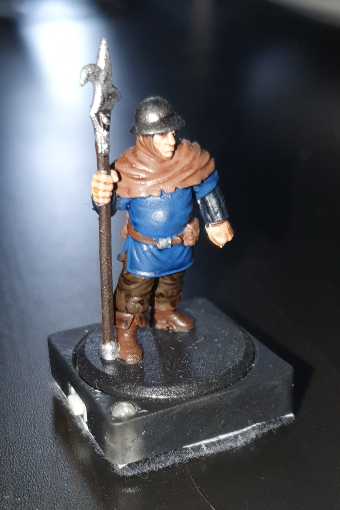
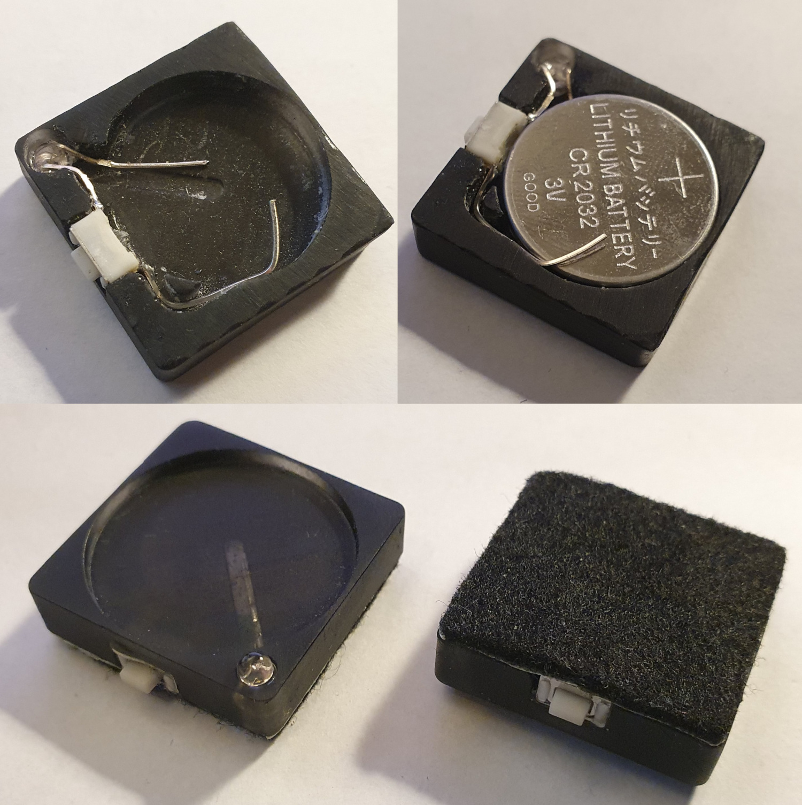

{align=right width=33%}

This page discusses the fabrication of the DIY bases. 
Discussed on this page are the required tools, materials and parts you need, a sourcing guide for 3D prints and electrical components, and the complete build instructions.

# Requirements

## Required Tools

* Soldering iron + solder
* Wire cutter
* Wire stripper
* Scissors
* Superglue

## Bill of Materials

* 3D printed parts (see below)
* 1x 3mm infrared LED (940nm)
* 1x Microswitch
* 1x CR2032 battery
* Felt that's big enough to cover the base (with adhesive pre-attached, or add double-sided tape)

## Sourcing Parts

#### 3D Prints

To build the base you will to print the base enclosure. There are currently 2 variants:

* Normal: Has a cavity into which the round base of a mini can fit
* Flat: Has a flat top (no cavity)

A resin printer is recommended for these parts, but FDM might also work if your printer is properly tuned (you might need to use a smaller nozzle).

If you do not own a 3D printer, and you do not know anyone who can print for you, you could consider one of the following print services:

* [3D Hubs](https://www.hubs.com/)
* [Shapeways](https://www.shapeways.com/)
* [i.Materialize](https://i.materialise.com/en)

### Electrinic Components

| Supplier              | IR LED | Microswitch |
|-----------------------|-----------------|----------------------|
| Mouser (US)           | [link](https://eu.mouser.com/ProductDetail/Kingbright/WP710A10F3C?qs=jBF9H7RTBaTxk2AdjwNryg%3D%3D) | [link](https://eu.mouser.com/ProductDetail/CK/RS032G05A3SMRT?qs=Gufeu08L%2Fl3gq3su6e3ufw%3D%3D) |
| Digikey (US)          |[link](https://www.digikey.com/en/products/detail/inolux/INL-3AHIR30/10384806)   [link](https://www.digikey.com/en/products/detail/sunled/XTNI11W/13559383) | [link](https://www.digikey.com/en/products/detail/w%C3%BCrth-elektronik/434121050816/5209081)   [link](https://www.digikey.com/en/products/detail/w%C3%BCrth-elektronik/434111050826/5209074) |
| Botland (PL)          | [link](https://botland.store/led-ir-infrared/869-ir-transmitter-vslb3940-3mm-940nm-5904422300975.html) | [link](https://botland.store/tact-switch/11104-tact-switch-3x6mm-5mm-smd-5pcs-5904422307585.html) |

# Instructions
{align=right width=50%}

1. Glue the switch in place (see the image below for positioning). Try to push it as far to the outside as possible and make sure it is flush with the top of the 3D print.
2. The LED has a positive and negative lead which can be distinguised by the length, where the positive lead is longer. Push the LED into its cavity with the positive (longer) lead to the switch side.
3. Bend the negative (shorter) lead so it fits in the groove, and cut it to size so it's approximately the length of the groove.
4. Bend the positive (longer) lead so it makes contact with the nearest contact on the switch.
5. Solder the lead to that contact.
6. Cut off any excess of the LED lead.
7. Solder the excess you just cut off to the other contact of the switch.
8. Bend it in such a way that it passes through the channel towards the center area, bent upwards.
9. Insert the CR2032 battery, positive side up, make sure the lead coming from the switch touches the battery (either the side or top).
10. Attach the felt and cut to size.

