# Full Sensor Build Instructions



This page discusses the fabrication of the full DIY sensor. If you are not sure whether you want to build the full or basic sensor, please head over to the [hardware overview](../hardwareOverview.md). 
Discussed on this page are the required tools, materials and parts you need, a sourcing guide for 3D prints and electrical components, and the complete build instructions.

## Before You Get Started
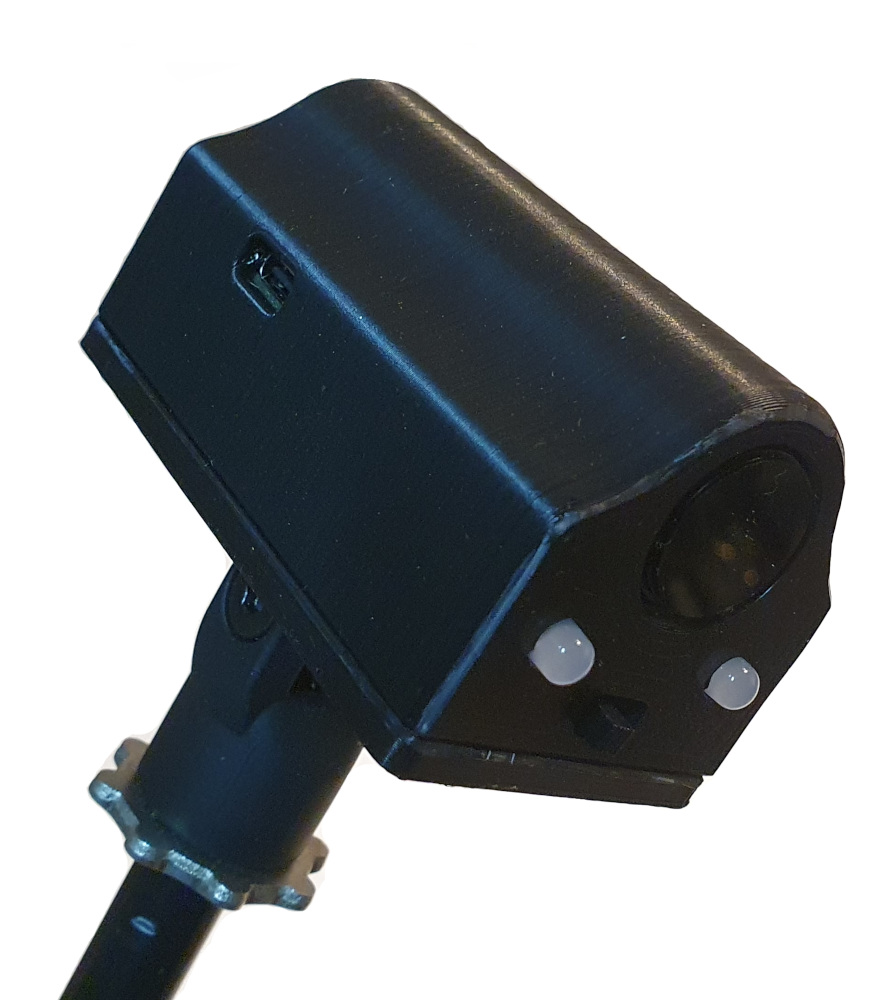{align=right width=33%}
The full sensor build requires one of the following ESP32 boards:

* TinyPico V1 or V2 (with micro-USB port, discontinued)
* TinyPico V3 (with USB-C port)
* TinyS3

For Material Plane, there is no noticable difference between these variants, so pick the one that you can source or the one that is cheapest.
In these build instructions there will be variant-specific things you need to do (such as which pins to connect everything to). In these cases, there will be a table to give these differences. Please take note of which variant you have so you don't make any mistakes.

There are variants of these board with no on-board antenna, <b>do not get one of those</b>.

## Requirements

### Required Tools

* Soldering iron + solder
* Wire cutter
* Wire stripper
* Knife
* Hot glue gun or superglue
* (Optional, but recommended) Electrical tape or heat shrink
* (Optional) M3 threading tool

### Bill of Materials

* [3D printed parts](https://github.com/MaterialFoundry/MaterialPlane_Models) (see below)
* A TinyPICO V1, V2 or V3, or a TinyS3
* DFRobot SEN0158
* 2x 5mm Red/Green or RGB <b>common cathode</b> LED
* 2x 180 Ohm wired resistor (200 or 220 Ohm will also work fine)
* 1x 12 KOhm wired resistor (TinyPICO only)
* 1x 22 KOhm wired resistor (TinyPICO only)
* 1x SPDT Slide Switch (approx 6x20mm)
* 1x Li-Ion battery (max size: 34x53x11mm)
* 9x M3x10mm countersunk bolts
* 1x M5x22mm bolt
* 1x M5 nut

### Sourcing Parts

#### 3D Prints

To build the sensor you will need one of each of the following parts (only the 'Sensor Main Body' is different), which you can download [here](https://github.com/MaterialFoundry/MaterialPlane_Models):

|Part| TinyPICO V1/V2 | TinyPICO V3 | TinyS3 |
|----|----------------|-------------|--------|
| Sensor Main Body | MainBody.stl | MainBody_USBC.stl | MainBody_USBC.stl |
| Sensor Lid | Lid.stl | Lid.stl | Lid.stl |
| Controller Bracket | ControllerBracket.stl | ControllerBracket.stl | ControllerBracket.stl |
| Sensor Bracket | SensorBracket.stl | SensorBracket.stl | SensorBracket.stl | 
| Microphone Mount | MicstandMount.stl | MicstandMount.stl | MicstandMount.stl | 

All parts, except for the sensor main body can be printed flat on the 3D printer's bed. The sensor main body was designed to be printed on it's front (the side with the holes).

Recommended printer parameters:

|               |                           |
|---------------|---------------------------|
| Material      | PLA, PLA+, PETG or ABS    |
| Nozzle        | 0.4 - 0.8mm               |
| Layer Height  | 0.2mm                     |
| Supports      | None                      |

If you do not own a 3D printer, and you do not know anyone who can print for you, you could consider one of the following print services:

* [3D Hubs](https://www.hubs.com/)
* [Shapeways](https://www.shapeways.com/)
* [i.Materialize](https://i.materialise.com/en)

#### Electronic Components

<b>Please note that the links below are a suggestion only and there may be mistakes. It is your own responsibility to make sure the part is compatible. 
If you find an incompatible part or a dead/incorrect link, please contact me.</b>

| Supplier              | TinyPICO/TinyS3 | DFRobot SEN0158 | LEDs  | Resistors | Switch | Battery |
|-----------------------|-----------------|----------------------|---|--|--|--|
| Mouser (US)           | [TinyPICO V3](https://nl.mouser.com/ProductDetail/Adafruit/5750?qs=mELouGlnn3eyxZ0u5J6K4g%3D%3D) [TinyS3](https://nl.mouser.com/ProductDetail/Unexpected-Maker/TS3-01?qs=Z%252BL2brAPG1LZhhN9kgkCAg%3D%3D) | [link](https://eu.mouser.com/ProductDetail/DFRobot/SEN0158?qs=lqAf%2FiVYw9hCccCG%252BpzjbQ%3D%3D) | [RG](https://nl.mouser.com/ProductDetail/Lite-On/LTL-30EFJ?qs=cXLtXeiLR4oiGhB%2FiN7QdQ%3D%3D) [RG](https://nl.mouser.com/ProductDetail/Kingbright/WP59SURKCGKW?qs=DkZGzo4b%252BTLYvNaeWp2TSg%3D%3D)   [RGB](https://nl.mouser.com/ProductDetail/Inolux/HV-5RGB60?qs=qSfuJ%252Bfl%2Fd7yi2o6d75%2FlQ%3D%3D) [RGB](https://nl.mouser.com/ProductDetail/Kingbright/WP154A4SUREQBFZGW?qs=w3%252Bcv6FlocrIOROaa2rdEg%3D%3D) | [180R](https://nl.mouser.com/ProductDetail/YAGEO/CFR-12JR-52-180R?qs=sGAEpiMZZMsPqMdJzcrNwoGf4yg8yZ12cdNq1hDg8HcsoQWkCZUsLg%3D%3D) [180R](https://nl.mouser.com/ProductDetail/YAGEO/CFR-12JB-52-180R?qs=sGAEpiMZZMsPqMdJzcrNwoGf4yg8yZ12Uh2QL1uzzDWOu5ApFpjX3Q%3D%3D)   [12K](https://nl.mouser.com/ProductDetail/YAGEO/CFR-12JB-52-12K?qs=sGAEpiMZZMsPqMdJzcrNwoGf4yg8yZ120Lb9mfgHCNbxWaNyTxfLQw%3D%3D) [12K](https://nl.mouser.com/ProductDetail/YAGEO/CFR-25JR-52-12K?qs=sGAEpiMZZMsPqMdJzcrNwvaJxHNPm0%2FxcSbCT5QYpDlJnM%252BqRx6jyA%3D%3D)   [22K](https://nl.mouser.com/ProductDetail/YAGEO/CFR-25JR-52-22K?qs=sGAEpiMZZMsPqMdJzcrNwsJljJEG6Yukd6qoZEzq39o%3D) [22K](https://nl.mouser.com/ProductDetail/YAGEO/CFR-25JR-52-22K?qs=sGAEpiMZZMsPqMdJzcrNwsJljJEG6Yukd6qoZEzq39o%3D) | [link](https://nl.mouser.com/ProductDetail/E-Switch/EG1201?qs=HKd%2Fp3M7KlXO9na9WUJSSA%3D%3D) | |
| Digikey (US)          | [TinyPICO V2](https://www.digikey.com/en/products/detail/adafruit-industries-llc/5029/14307381)   [TinyS3](https://www.digikey.com/en/products/detail/adafruit-industries-llc/5398/16499316) | [link](https://www.digikey.com/en/products/detail/dfrobot/SEN0158/7087147?s=N4IgTCBcDaIDoBcAEBlAogOQAwEYCsAHCALoC%2BQA) | [RG](https://www.digikey.com/en/products/detail/american-bright-optoelectronics-corporation/BL-BUBGE204/9678166) [RG](https://www.digikey.com/en/products/detail/kingbright/WP59SURKCGKW/2785960)   [RGB](https://www.digikey.com/en/products/detail/nte-electronics-inc/NTE30156/11646510) [RGB](https://www.digikey.com/en/products/detail/inolux/HV-5RGB60/7604616) | [180R](https://www.digikey.com/en/products/detail/stackpole-electronics-inc/CF14JT180R/1741307) [180R](https://www.digikey.com/en/products/detail/yageo/MFR-25FBF52-180R/9138058)   [12K](https://www.digikey.com/en/products/detail/stackpole-electronics-inc/CF14JT12K0/1741282) [12K](https://www.digikey.com/en/products/detail/stackpole-electronics-inc/CFM14JT12K0/1742076)   [22K](https://www.digikey.com/en/products/detail/stackpole-electronics-inc/CF14JT22K0/1741350) [22K](https://www.digikey.com/en/products/detail/stackpole-electronics-inc/RNMF14FTC22K0/2617315) | [link](https://www.digikey.com/en/products/detail/cit-relay-and-switch/MS1201L5B/21619487)   [link](https://www.digikey.com/en/products/detail/e-switch/EG1201/101720) | [link](https://www.digikey.com/en/products/detail/sparkfun-electronics/PRT-18286/14302550)   [link](https://www.digikey.com/en/products/detail/jauch-quartz/LP103048JU-PCM-2-WIRES-70MM/9560992) |
| RobotShop (US)        | | [link](https://www.robotshop.com/en/ir-tracking-camera.html) | [RGB](https://www.robotshop.com/products/sfe-triple-output-led-rgb) | | | |
| TinyTronics (NL)      | [TinyPICO V3](https://www.tinytronics.nl/shop/en/development-boards/microcontroller-boards/with-wi-fi/unexpected-maker-tinypico-v3-esp32-development-board-usb-c) | [link](https://www.tinytronics.nl/shop/en/sensors/optical/infrared/dfrobot-gravity-ir-positioning-camera) | [RGB](https://www.tinytronics.nl/shop/en/components/leds/leds/rgb-led-5mm-diffuse-common-cathode) | | | |
| OpenCircuit (NL)      | | [link](https://opencircuit.shop/product/gravity-ir-positioning-camera-for-arduino) | [RGB](https://opencircuit.shop/product/rgb-5mm-leds-common-cathode-10-stuks) | [180R](https://opencircuit.shop/product/180%CF%89-metal-film-resitor-1-4w-10-pieces)   [12K](https://opencircuit.shop/product/12k%CF%89-metal-film-resitor-1-4w-10-pieces)   [22K](https://opencircuit.shop/product/22k%CF%89-metal-film-resistor-1-4w-10-pieces) | | |
| Gotronic (FR)         | | [link](https://www.gotronic.fr/art-camera-ir-de-positionnement-sen0158-22705.htm) | [RGB](https://www.gotronic.fr/art-led-rgb-5-mm-rgb5-dif-2099.htm) | [180R](https://www.gotronic.fr/art-10-resistances-1-4w-180-8486-349.htm)   [12K](https://www.gotronic.fr/art-10-resistances-1-4w-12k-8486-2582.htm)   [22K](https://www.gotronic.fr/art-10-resistances-1-4w-22k-8486-2585.htm) | | [link](https://www.gotronic.fr/art-accu-lipo-3-7-vcc-1000-mah-pr523450-5813.htm)   [link](https://www.gotronic.fr/art-accu-lipo-3-7-vcc-1500-mah-thym-bat-37198.htm) |
| Botland (PL)          | | [link](https://botland.store/arduino-rpi-cameras/19901-gravity-ir-positioning-camera-for-arduino-dfrobot-sen0158--5903351246330.html) | [RGB](https://botland.store/rgb-led/1667-led-rgb-5mm-matte-common-cathode-5-pcs-5903351244152.html) | [assortment](https://botland.store/resistor-packs/813-set-of-tht-1-4w-resistors-described-2640pcs-5903351241076.html) | | [link](https://botland.store/battery-li-pol-1s-37-v/15626-akyga-li-pol-cell-1500mah-1s-37v-jst-bec-connector-socket-50x34x8mm-5904422324322.html)   [link](https://botland.store/battery-li-pol-1s-37-v/12212-akyga-li-pol-1600mah-1s-37v-battery-jst-bec-connector-socket-50x34x9mm-5904422318895.html) |
| DFRobot (CN)          | | [link](https://www.dfrobot.com/product-1088.html) | | | | |
| LCSC (CN)             | | | | | [link](https://www.lcsc.com/product-detail/Slide-Switches_G-Switch-SS-12F16-G050_C2876006.html)| |
| Unexpected Maker (AU) | [TinyPICO V3](https://unexpectedmaker.com/shop.html#!/TinyPICO/p/577111313/category=154494282)   [TinyS3](https://unexpectedmaker.com/shop.html#!/TinyS3/p/577100101/category=154222511) | | | | | |
| Pimoroni (UK)         | [TinyPICO V3](https://shop.pimoroni.com/products/tinypico-v2?variant=39285089534035)   [TinyS3](https://shop.pimoroni.com/products/tinys3-esp32-s3?variant=39854967881811) | | [RGB](https://shop.pimoroni.com/products/led-rgb-clear-common-cathode?variant=44298388170) | [assortment](https://shop.pimoroni.com/products/resistor-grab-bag?variant=370750519) | | [link](https://shop.pimoroni.com/products/lipo-battery-pack?variant=20429082183) |
| Adafruit (US)         | [TinyPICO V3](https://www.adafruit.com/product/5028)   [TinyS3](https://www.adafruit.com/product/5398) | | | | | |

## Pinout
While the pin numbers that are used for each variant are stated at each relevant step in the build instructions, you can use the table below as a quick reference.

|                   | TinyPICO V1/V2    | TinyPICO V3       | TinyS3            |
|-------------------|-------------------|-------------------|-------------------|
| SDA               | 21                | 21                | 8                 | 
| SCL               | 22                | 22                | 9                 | 
| LED 1 Red         | 26                | 26                | 7                 | 
| LED 1 Green       | 25                | 25                | 6                 |
| LED 2 Red         | 15                | 15                | 5                 | 
| LED 2 Green       | 27                | 27                | 21                |  
| USB Active        | 32                | 32                | None (internal)   |
| Charge Detect     | None (internal)   | None (internal)   | 1                 |

## Instructions

1. 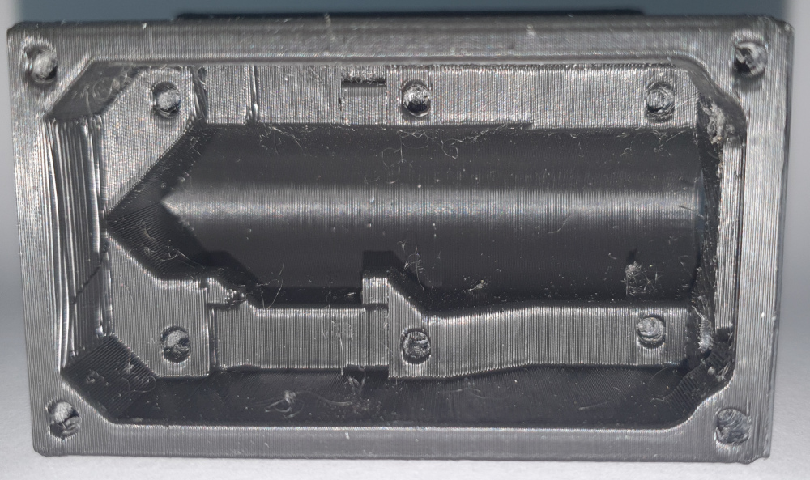{align=right width=33%}Clean the enclosure, and make sure all components fit. Especially the DFRobot SEN0158 and the TinyPICO/TinyS3 might be a tight fit (scroll down see the images for the proper placement and positioning). If necessary, cut away small parts of the enclosure with a sharp knife to make room for the components. You might have to drill out the LED holes with a 5mm drill, if they do not fit.
2. Either use a M3 threading tool to create threads in all holes. Alternatively, grab an M3 bolt, and screw it into all the holes to form the thread. It should give some resistance (and the bolt will get hot, so you might have to let it cool down between holes), but it should be possible without too much problems, if not, predrill the holes with a 2.5mm drill.
3. 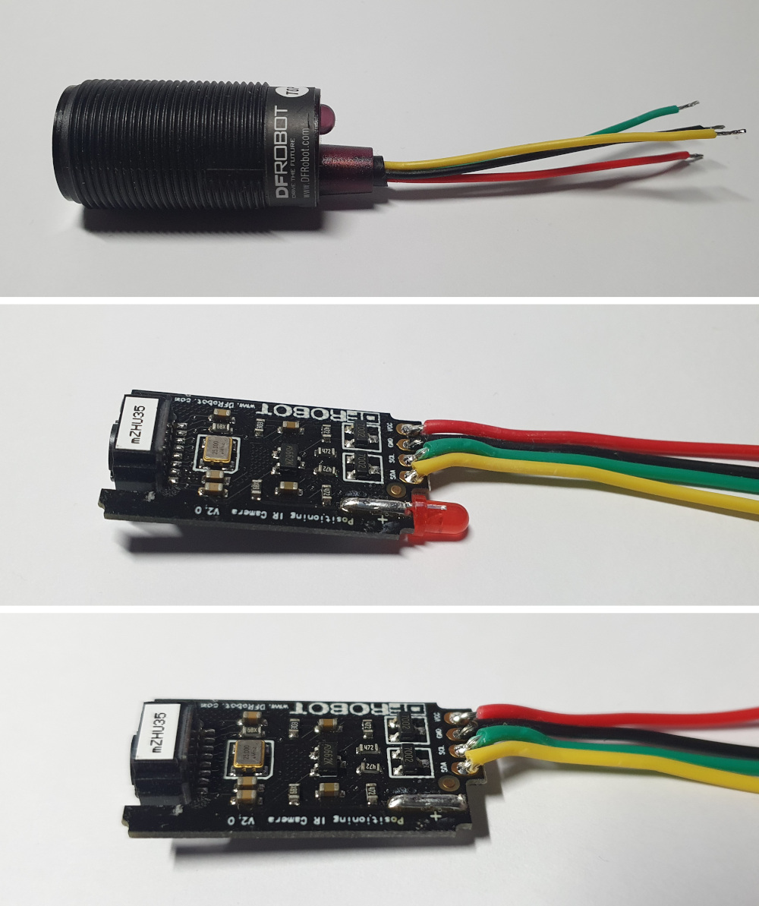{align=right width=33%}Using a wire cutter, cut the length of the cable of the DFRobot SEN0158 to around 5 cm (keep the rest for later), and carefully remove the outer sleeve using a knife. If you choose to remove the LED form the DFRobot SEN0158 (see step 5), it might be easier to remove the outer sleeving after opening the DFRobot SEN0158.
4. Strip a few millimeters off each of the 4 DFRobot SEN0158 wires, and pre-tin them (apply a bit of solder to them).
5. (Optional) Remove the LED inside the DFRobot SEN0158. This will reduce the power consumption by around 20 mA, increasing battery life:
    1. Removing the label.
    2. Pry open the top using a knife (it is glued in place, so it might take some force).
    3. Removing the circuit board.
    4. Desoldering/cut the LED. 
    5. Re-insert the circuit board into its enclosure (note the groove on the far side of the enclosure, into which the circuit board fits). 
    6. Re-apply the label or wrap some tape around the end of the DFRobot SEN0158 to prevent the circuit board from falling out.
6. (<b>TinyS3 only</b>) At the bottom of the board, solder a piece of wire between pin 1 and one of the pads labeled 'CUT TO DISABLE CHRG LED'. You can use a piece of the leads of the LEDs that you will cut in step 8. 
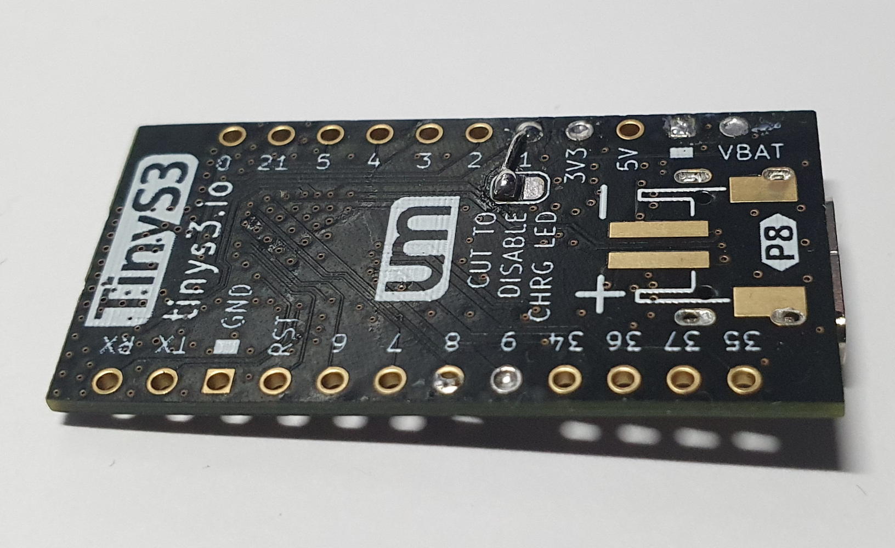{align=center width=33%}
7. 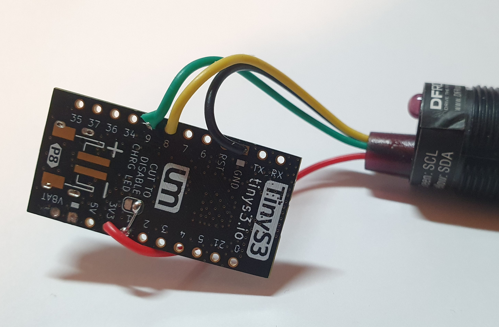{align=right width=33%}Solder the 4 wires from the IR sensor to the TinyPICO/TinyS3:

    | Wire Color    | Function  | TinyPICO pin      | TinyS3 pin        |
    |---------------|-----------|-------------------|-------------------|
    | Red           | Power     | 3V3               | 3V3               |
    | Black         | Ground    | GND (next to RST) | GND (next to RST) |
    | Yellow        | SDA       | 21                | 8                 |
    | Green         | SCL       | 22                | 9                 |

8. 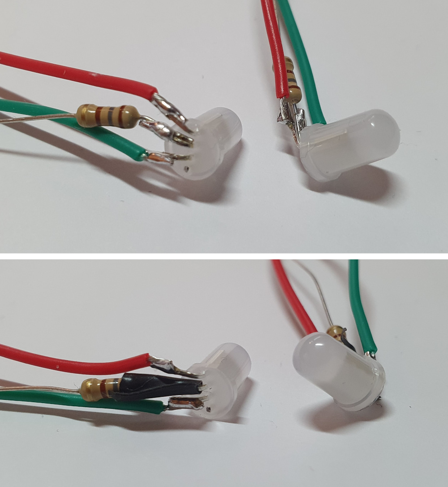{align=right width=33%}Take the 2 LEDs and 2 180 Ohm resistors. The next steps will have to be performed on both LEDs. 
    1. Figure out what each lead of the LED does. Either use the datasheet, or test it by supplying a low voltage (max 5V @ 20mA) between the longest (ground) lead and the others, you could use a coin cell for this. For the RGB LED I used, starting from the shortest lead, it was:

        | Lead Length   | Function  |
        |---------------|-----------|
        | Shortest      | Blue      |
        | Medium        | Green     |
        | Longest       | Ground    |
        | Medium        | Red       |
    
    2. (<b>RGB LEDs only</b>) Cut the lead for the blue LED off as far as possible. The blue will not be used.
    3. Bend all leads to a 90 degree angle.
    4. Cut the longest (ground) lead to a length of approximately 5mm, do the same for one lead of the 180 Ohm resistors.
    5. Solder the 5mm lead of the resistor to the ground lead of the LEDs.
    6. Grab/cut 80mm red and green wires (from the remaining wire of the DFRobot SEN0158), strip a few millimeters of each side and pre-tin them.
    7. Cut the red lead of the LED to a length of approximately 5mm, and solder the red wire to it.
    8. Do the same for the green lead and wire.
    9. (Optionally, but recommended) Apply electrical tape or heat shrink around the lead close to the LED to electrically isolate the leads (to prevent shorts). Do this at least for the ground lead, and optionally for the others.

9. 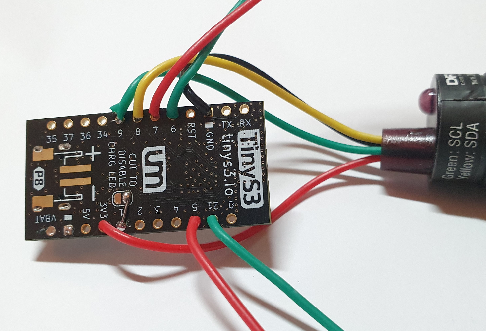{align=right width=33%}Solder the wires from the LEDs to the TinyPICO/TinyS3 at the following pins:

    | LED   | Wire      | TinyPICO pin  | TinyS3 pin    |
    |-------|-----------|---------------|---------------|
    | 1     | Red       | 26            | 7             |
    | 1     | Green     | 25            | 6             |
    | 2     | Red       | 15            | 5             |
    | 2     | Green     | 27            | 21            |  

10. 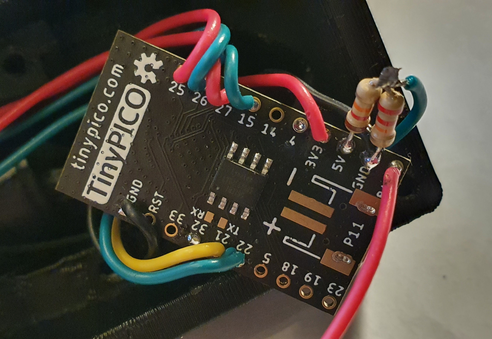{align=right width=33%}(<b>TinyPICO only</b>) Grab the 12 KOhm and 22 KOhm resistors.
    1. Cut the length of one lead of each resistor to a length of approximately 5mm.
    2. Solder the two 5mm leads together.
    3. Solder the other leg of the 22 KOhm resistor to GND (between 5V and BAT).
    4. Solder the other leg of the 12 KOhm resistor to 5V.
    5. Trim the length of the exposed leads.
    5. Cut a piece of wire to a length of approximately 4 cm (from the remaining wire of the DFRobot SEN0158), strip a few millimeters of each side and pre-tin them.
    6. Solder one side of the wire to the previously soldered connection between the 12 and 22 KOhm resistors, and solder the other side to pin 32.
11. 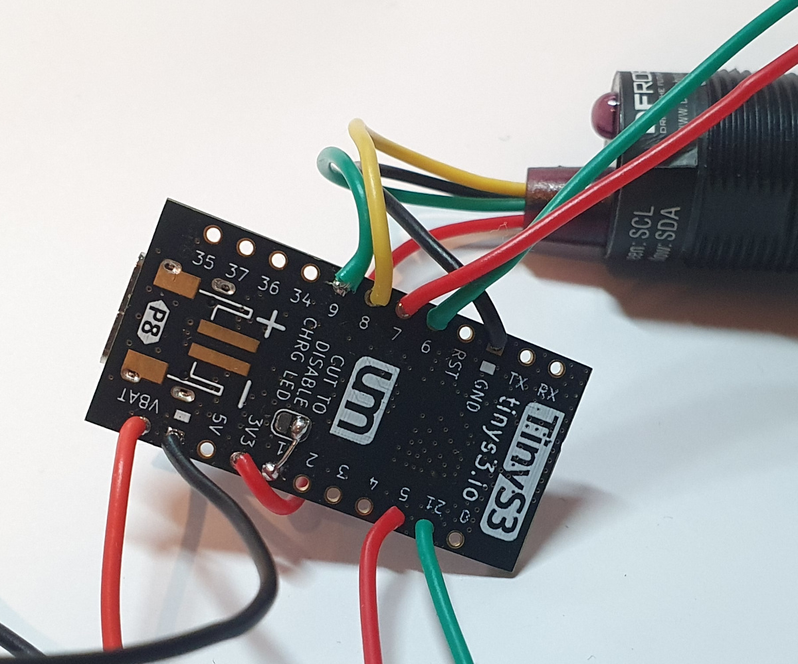{align=right width=33%}Cut a piece of black wire to a length of 8 cm (from the remaining wire of the DFRobot SEN0158), strip and pre-tin each side and solder one side to GND.
    * TinyPICO: Solder it to the lead of the 22 KOhm resistor.
    * TinyS3: Solder it to the GND pin between 5V and VBAT.
12. Solder the positive (red) wire of the battery to BAT/VBAT.
13. Carefully glue the switch to the enclosure with hot glue (or superglue). Make sure you only glue the tabs or sides of the switch, so it can still slide freely afterwards.
14. Push the two LEDs into the holes close to the switch. LED 1 should go into the left hole (see image for orientation and the table at point 9 to identify which LED is which) and LED 2 in the right hole. Apply some glue if the fit is loose.
15. Solder the black wire connected to GND on the TinyPICO/TinyS3 and the two resistors that are connected to the LEDs to the center lug of the switch. Trim the excess leads of the resistors.
16. If the ground (black) wire of the battery is shorter than 60mm, extend it using the remaining wire of the DFRobot SEN0158. Make sure you cover the solder connection with electrical tape or heat shrink.
17. Solder the ground (black) wire of the battery to the left lug of the switch (see the image for orientation).
18. Slide the DFRobot SEN0158 inside its cavity (from the inside) until it sticks out slightly at the front of the enclosure and loosely clamp it down with the 'SensorBracket'. It should still be able to rotate. 
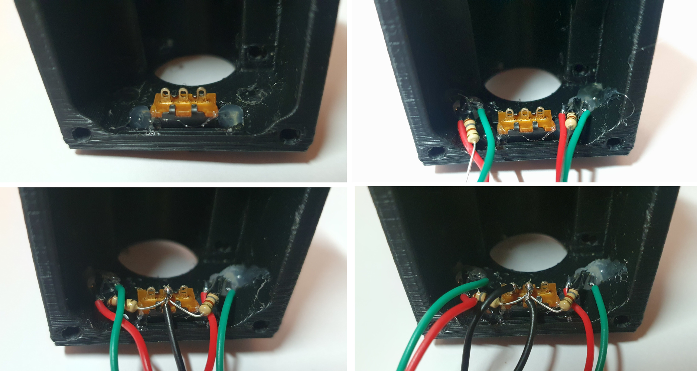{align=center width=50%}
19. Place the TinyPICO/TinyS3 in it's recess in the enclosure and clamp it down with the 'ControllerBracket' (don't overtighten!).
{align=center width=66%}
20. [Update the firmware and webserver onto the sensor.](../Updating/sensorUpdating.md)
21. [Connect the sensor to WiFi.](../SensorConfiguration/sensorConnecting.md)
22. [Go to the 'Coordinates' section of the sensor settings](../SensorConfiguration/sensorSettings.md)
23. Place the sensor down on a flat surface and move a base horizontally in front of it. Now rotate the DFRobot SEN0158 inside the sensor until the movement of the dot in the 'Coordinates' section also moves horizontal.
24. Screw down the DFRobot SEN0158 properly so it cannot move anymore.
25. Insert the battery and screw down the sensor lid and use the M5 bolt and nut to attach the 'MicstandMount' to it.

The sensor is now ready to be used.

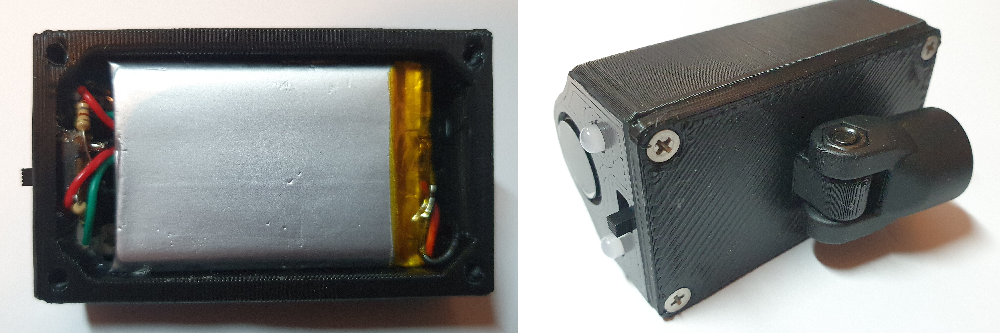{align=center width=50%}