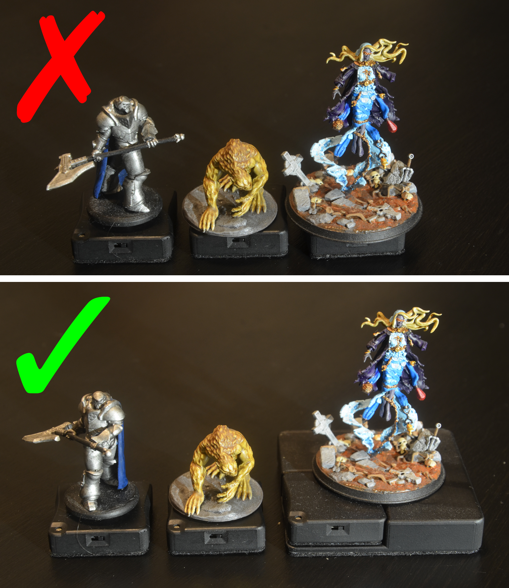

# Mini Placement

{align=right width=33%}

When mounting a mini on a base, there is one important thing to remember: there needs to be line-of-sight between the infrared LED and the sensor. There are multiple ways in which the placement of the mini can affect this.

The image on the right shows 3 minis, with incorrect placement at the top and correct placement at the bottom. 
From left to right:

* The weapon of the mini is directly above the infrared LED. This means that in most situations the sensor will have a hard time detecting the base. This can be solved by rotating the mini.
* The base of the mini blocks the infrared LED, so the sensor cannot detect it. This can be solved by moving the mini a bit.
* The mini is too big for the base. There is no good way to mount it while keeping the infrared LED visible to the sensor. There is currently no suitable DIY solution for this.

# Orientation and Holding of Bases

During the [calibration procedure](calibration.md) you had to keep the orientation of the base constant relative to the display, for example by keeping the LED in the top-right. When using the base during gaming you have to stick to this orientation, so rotating the base is not possible. You can, of course, rotate the mini on top of the base.

{align=right width=33%}

When moving bases, you should try to keep them as horizontal as possible. If the base is held at an angle, the relative light emission of the base (so from the perspective of the sensor) is reduced, and if the angle is too big, the sensor will not be able to detect the base. 
An exception to this is if the base is located near the edge of the display. In this case, it can be helpful to angle the base towards the sensor.

Make sure your finger or any other object does not obscure the LED to prevent line of sight between the LED and sensor. Because the base is activated by touching one of its sides, this will usually not be an issue.

Take a look at the image on the right, which demonstrates these 2 problems, with the upper images showing the incorect way and the lower images the correct way of holding bases. 
From left to right:

* Base held at too much of an angle. Reduce the angle to make it easier for the sensor to detect the base.
* Index finger too close to the infrared LED, which might block the line-of-sight between the LED and sensor. Hold the base with the thumb and index finger, or move the index finger away.

# Token Detection
For the DIY hardware, token detection is done using the location of the base. Whenever a base is moved, Material Plane checks if there are any tokens close enough. If there are, it will pick the nearest (that is allowed to be moved) and move that token. 
Potential issues are that if any interruption occurs, the token might be dropped, and it can result in the wrong token being moved if multiple tokens are close to each other.