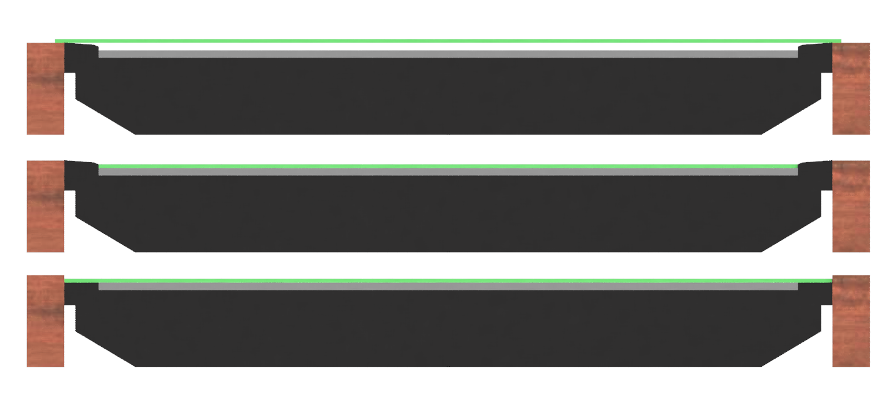

Depending on your choice of display, you will want to consider adding some kind of protection. While both the production and the DIY bases have felt on the bottom, there is still some risk of scratching the display.

## Material Options
The following materials are the most common for this type of application:

* Acrylic (also known as Plexiglass, Perspex or PMMA)
* Polycarbonate (also known as Lexan)
* Glass

Acrylic and polycarbonate are both transparent polymers that are used often as an alternative for glass. Their main advantages are their shatter resistance and lower weight.

See below for a comparison table of these materials. 
One or more plusses means it's more favorable, while minusses means it's less favorable.

|  | Acrylic | Polycarbonate | Glass |
|--|---------|---------------|-------|
| Scratch Resistance | - | - - | ++ |
| Shatter Resistance | + | ++ | - - |
| Bend resistance | - | - - | ++ |
| Workability (Easy to cut to size) | + | ++ | - |
| Weight | + | + | - |
| Price | + | -/+ | - |

In general: If you can get away with using glass, it's probably the best option. You'll need to make sure it's thick enough so it doesn't break easily. Due to the weight, this is probably not a good solution for portable setups. 
For other situations, acrylic is probably the best option. It is more scratch and bend resistant than polycarbonate, and generally cheaper. The main disadvantage is its shatter resistance, however, this is generally not a problem.

## Mounting Considerations
{align=right width=50%}

An important thing to consider is how the protective sheet will be mounted on or above the display. Consider the 3 cases in the image, where a cross section of a TV enclosure is displayed, with the TV in dark-grey, the actual LCD in light-grey and the protective sheet in green.

If your display has a raised bezel, as is the case in the top and middle image, you can either rest the protective sheet on the bezel (top) or on the LCD (middle). The main reason to go for the top option is that the LCD is usually quite fragile, so resting a heavy protective sheet directly on top of it can cause damage. The disadvantage of the top option is that the sheet is suspended in the air. This means that the bend resistance of the material becomes an important factor, and there is a risk of shattering the sheet if something falls on it (mainly an issue for glass). By increasing the sheet thickness you can counter these issues, however, this increases the distance between the display and mini, which can cause [parallax issues](#parallax-issues). 
If you do decide to go with the middle option, make sure you use a light and thin sheet. However, you should be aware that if the display (and thus the protective sheet) heats up, it can start bending, especially for thin acrylic and polycarbonate. 
If your display does not have a raised bezel, as shown in the bottom option, you have the most freedom with regards to mounting options, because you can choose to mount the protective sheet directly on the display (as shown in the image), or add some space between the sheet and the display. Many displays without raised bezel already have a glass plate on top of the display, onto which you can quite safely lay a protective sheet (although you could consider not using any protection because the glass itself is already quite suitable). Even if the display has no glass plate, the fact that the sheet partially rests on the bezel instead of completely on the LCD (as in the middle option) is already a great improvement.

## Parallax Issues
Because the display is observed from a low vantage point, parallax can become an issue. 
Parallax is the shift of the apparent location of an object with respect to a background, depending on the viewpoint. For example, if you hold out a finger in front of you, and look at it with one one, and then the other, you will notice that the apparent position of the finger changes.

In a situation with a gaming display and minis, this issue can arise when the distance between the display and the mini is big. For example, if a 1cm thick protective sheet is added, and the display is looked at from the side (so a normal player position), the mini will appear to float above the display, and the mini will not appear to be centered on the grid. If you then move the mini so it's centered on the grid, and move to the other side of the display, you'll notice that the mini is no longer centered. Even worse, it is now more off-center than it was before you tried to center it.

Due to parallax, it is impossible to have a situation where the mini appears to be centered on the grid from every position. The further the mini is above the display (due to the protective sheet and possibly air between the sheet and display), the more pronounced this effect is.