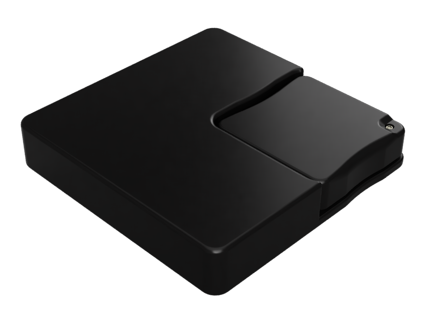

{align=right width=33%}
Base adapters allow bigger minis to be tracked. Normal bases slot into these adapters, allowing one of the touch sensitive sides of the base to be used to activate the base. 
Embedded magnets hold the base in place and allow the mini to be securely attached using square or round magnets or bigger magnetic plates. 
The base adapters come in 2x2, 3x3 and 4x4 sizes.