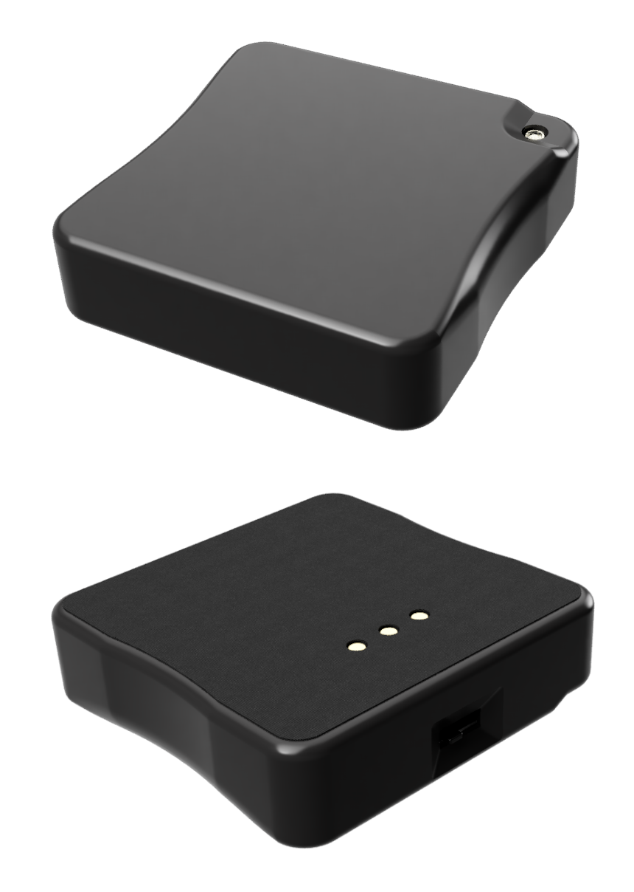

## Overview

{align=right width=33%}

The Material Plane bases are responsible for transmitting the location of a physical mini to the VTT. The base is a small block that is mounted underneath the mini that contains an infrared LED which the sensor can detect.

The base has an infrared and red LED, the infrared LED is used for tracking while the red LED is used as a status indicator, which is hidden inside the enclosure but its light will be visible. The red LED will switch on when the base is active (being moved). 
At the top side the base has a power switch, and the left and right side are touch sensitive to activate the base.

The bottom of the base has 3 pins that are used for charging and updating the firmware of the base. Additionally, the bottom of the base is covered by felt to prevent damage to your display.

<b>Specs:</b>

* 120mAh battery
* Charging and programming using the dock
* Infrared tracking and red indicator LEDs
* Power switch
* Felt on the bottom to prevent damage to your display
* 30x30x8mm (WxLxH)
* 8 gram

## Power States
The base has 3 power states:

* <b>Off:</b> The base will not do anything, but can be charged or programmed. The base should be in this state when not in use. 
* <b>Standby:</b> The base is switched on, but not being touched/moved. The base should be in this state when placed on the display during gaming.
* <b>Active:</b> The base is switched on and being touched/moved. Both the red and infrared LED are on and the sensor is able to detect the location of the base.

## Charging
{align=right width=33%}
Bases are charged using the dock or base charging dock expansion. Both have space for charging up to 4 bases simultaneously. Charging is possible due to the spring terminals on the dock or dock expansion, which connect to the terminals at the back of the base. 
To charge a base, insert it into one of the four charging slots. The correct orientation is to have the on/off switch of the base towards the top and the USB port of the dock to the left, see the image. 
Each charging slot has a status LED which can indicate 3 different states:

* <b>Off:</b> No base connected.
* <b>Red (fading):</b> Base charging.
* <b>Green (static):</b> Base charging completed.

Charging from empty to full takes approximately 90 minutes. Charging can take longer if the power supply cannot provide enough current.

## Battery Life
If the base is off, its power consumption is negligible. When the base has not been used for a few weeks a recharge before a game is recommended. In the standby state, the base will last for more than 24 hours on a full charge. In the active state, the base will last for approximately 2 hours.
During normal gaming, a base is in the standby state the vast majority of the time, only going into the active state whenever the base is being moved. This means that the base might only be in the active state for a few minutes for every hour of gaming. Under normal gaming conditions, you can expect a base to last more than 12 hours on a full charge.
