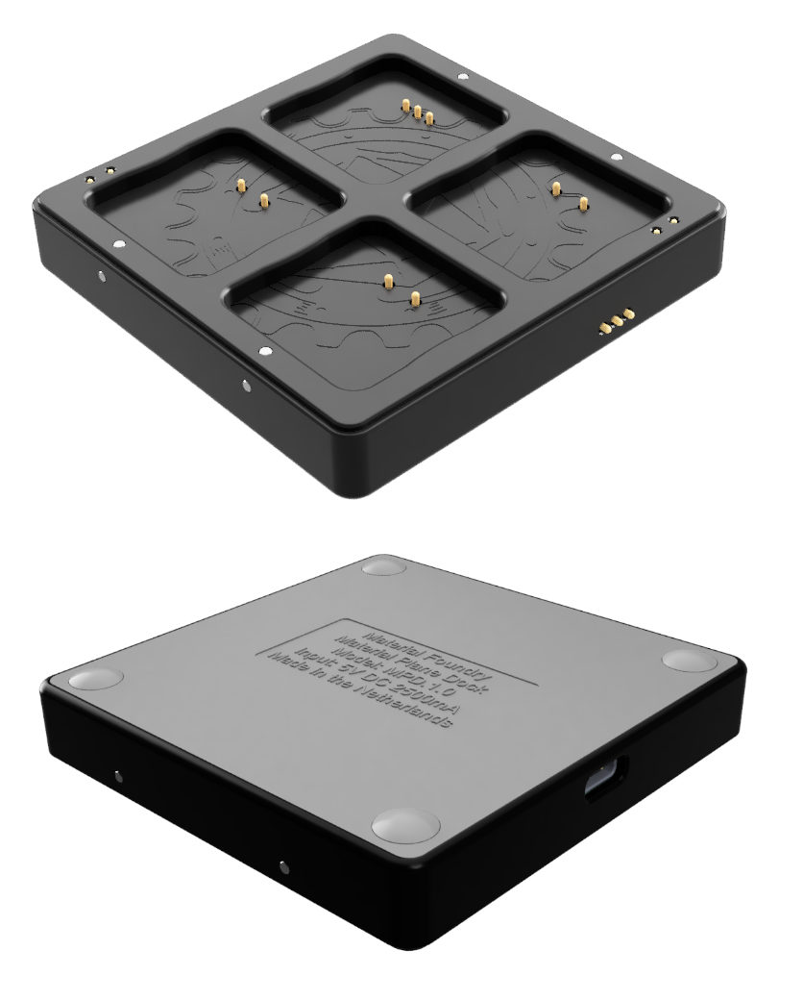
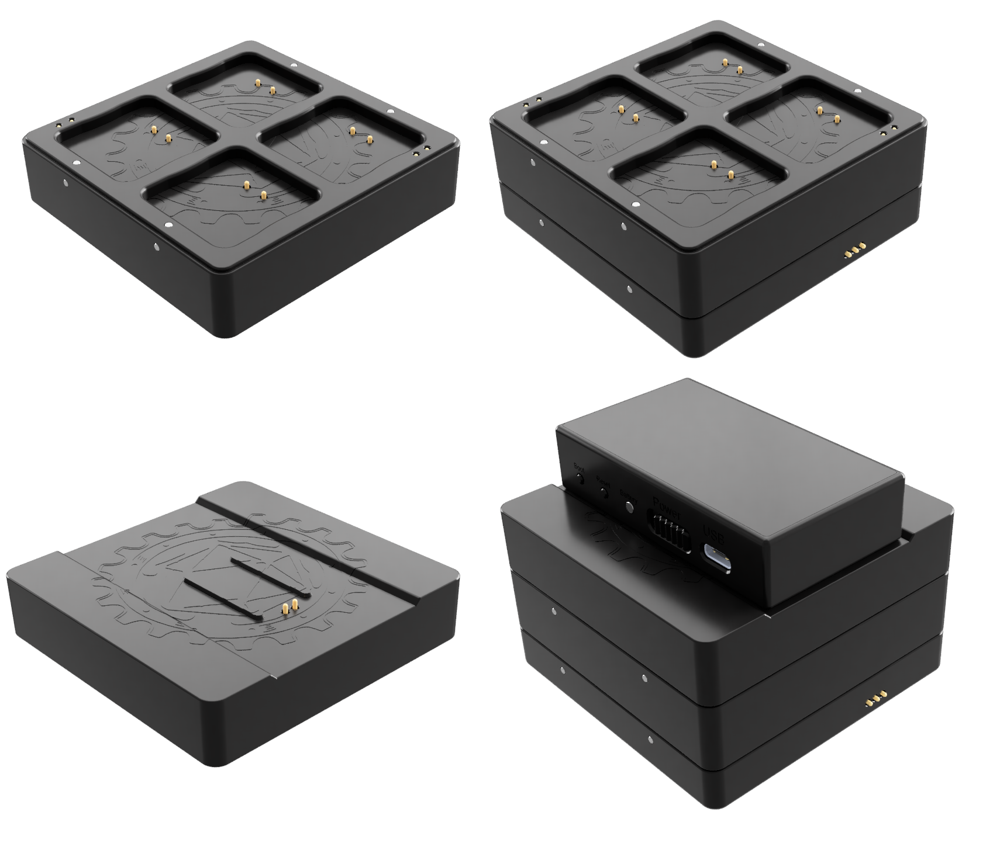

## Overview
{align=right width=33%}

The dock has 2 main functions: charging and programming the bases and pen. The dock has 4 charging slots for bases and 1 for the pen. The top-left base charging slots (with 3 spring terminals) and the pen charging port can also be used to configure and program the bases and pen. 
Powered is delivered through a USB-C connector. 
It is possible to stack dock expansions on top of the dock to allow more bases to be charged, or to allow you to charge the sensor using the dock. They are held onto the dock using magnets. You can stack multiple of these expansions on top of each other. Stacking is possible in 2 orientations (rotated by 180 degrees), by aligning the contacts of the dock with the spring terminals on the bottom of the expansion. The magnets in the dock and expansions should prevent incorrect stacking.

<b>Dock Specs:</b>

* Charges up to 4 bases and 1 pen at the same time
* Program and configure bases and pens
* Stack max 4 base charging dock expansions or 2 base and 1 sensor charging dock expansions
* 5VDC at max 2500mA over USB-C
* 81x80x16mm (WxLxH)
* 68 gram

## Base Charging
{align=right width=33%}
The dock can charge 4 bases at the same time. The bases are mounted onto the dock using embedded magnets and are charged through the spring terminals. To find the correct base orientation for charging take a look at the underside of a base where you will find 3 contacts. These contacts must mate with the spring terminals on the dock. This is only possible in 1 orientation, see the image on the right. 
Each base has its dedicated charge indicator LED which is visible from the top and the side, and can indicate the following 3 states:

* <b>Off:</b> Base not mounted.
* <b>Red (fading):</b> Base charging.
* <b>Green (static):</b> Base charging completed.

## Pen Charging
The dock can charge 1 pen at a time. The pen is mounted onto the side of the dock using embedded magnets and is charged through the spring terminals. Due to the magnet polarity, the pen can only be mounted in 1 orientation (see the image). Do not try to force the pen to connect the dock in the wrong orientation, this can damage the pen, the dock, or both. 
Charging is handled inside the pen, for more information on charging, please consult the [pen page](pen.md).

## Base Charging Dock Expansion
{align=right width=33%}
Each base charging expansion allows you to charge an additional 4 bases. You should not stack more than 4 base charging expansions on a single dock, allowing you to charge a maximum of 20 bases at the same time. If you also use the sensor charging expansion, you should not stack more than 2 base charging expansions, allowing a maximum of 12 bases. 
Charging bases on the base charging expansion is identical to the dock.

<b>Base Charging Dock Expansion Specs:</b>

* Charges up to 4 additonal bases
* 80x80x20mm (WxLxH)
* 82 gram

## Sensor Charging Dock Expanion
The sensor charging expansion allows you to charge the sensor on top of the dock. The sensor charging expansion can be stacked on top of a dock or base charging expansion. You cannot stack expansions on top of the sensor charging expansion.
The sensor has 2 exposed pins on the bottom, these mate with the 2 spring terminals on the sensor charging expansion. By mounting the sensor on the expansion in such a way that the spring terminals align to the exposed pins, the sensor will start charging.

<b>Sensor Charging Dock Expanion:</b>

* Charges the sensor
* 80x80x20mm (WxLxH)
* 65 gram

## Power Supply Requirements
To power the dock and expansions you need a USB charger from a reputable brand. The USB charger should be able to provide approximately 500mA for each dock and each base charging expansion, and 1000mA for the sensor charging expansion. For example:

* A dock without expansions: 500mA
* A dock with a base charging expansion: 1000mA
* A dock with a base charging and sensor charging expansion: 2000mA

## Expansion Stacking Limitations
There is a limit to the amount of expansions you can stack on top of a single dock. This is determined by the charging current of all the parts that are being charged.

It is recommended to stack a maximum of 2 base charging expansions if a sensor charging expansion is also used, for a total of 12 bases. Or a maximum of 4 base charging expansions if no sensor charging expansion is used, for a total of 20 bases.

This is quite conservative, to make sure the fuse inside the dock isn't tripped. However, you can probably get away with stacking more base charging expansions on the dock, because it is unlikely that all bases and the sensor will draw the maximum allowed current, <b>but this is at your own risk</b>. 
If your charger cannot provide more than 2500mA, the fuse should never trip, regardless of the amount of expansions you use. This is a safe way to do this, assuming you use a good quality charger. If, in this situation, too many expansions are stacked onto the dock, the power supply voltage may drop which might prevent anything from charging.