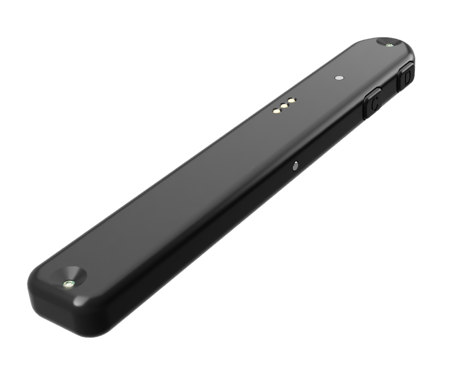
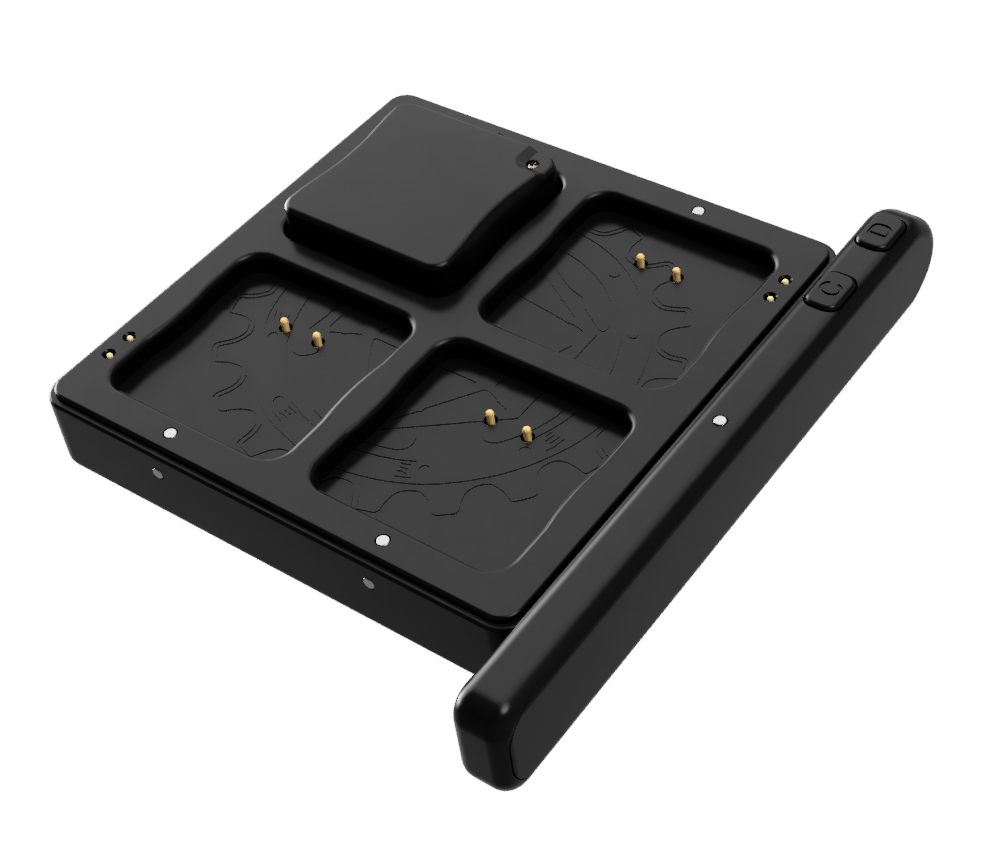

## Overview

{align=right width=33%}
The pen is an optional accessory that can be used to expand the capabilities of a Material Plane setup. It can be used like a mouse for clicking or selecting things in the VTT, and the sensor can detect the orientation of the pen for rotating objects. 
The pen has many functions, such as:

* Moving or rotating tokens
* Targeting tokens
* Panning or zooming the map
* Creating drawings
* Creating templates

The pen has 4 buttons to allow these functions to be performed. Using 2 infrared LEDs the sensor can detect the orientation of the pen for rotation purpose. The pen has a red status LED on the top and a geen/red charging LED on its side. The red LED will switch on when the pen is active, while the green/led charging LED switches on when the pen is charging.

<b>Specs:</b>

* 110mAh battery
* Charging and programming using the dock
* 2 Infrared tracking LED, 1 red indicator LEDs and 1 red/green charge indicator LED
* 4 switches
* 16x105x8mm (WxLxH)
* 13 gram

## Power States
The pen has 2 power states:

* <b>Standby:</b> The pen is not doing anything. It is always in this state unless activated, and it will automatically return to this state after activation.
* <b>Active:</b> One or more of the buttons on the pen is pressed to activate the pen. The red and at least one infrared LED are on and the sensor is able to detect the location of the pen. The pen will stay in this state for a configurable amount of time, after which it will return to the standby state.

## Charging
{align=right width=33%}
The pen has to be charged on the dock. The dock has 3 spring terminals sticking out on the right side of the dock (opposite side of the USB port), these mate with 3 contacts on the pen. To charge the pen, orient the pen is such a way that the contacts can touch the spring terminals on the dock, with the side of the pen with C and D buttons pointing to the front, see the image.
The pen is held in place using magnets. You should be prevented from mounting the pen incorrectly due to the magnets. Don’t try to force the pen and dock together if you feel a resistance, incorrectly mounting the pen can damage the dock, pen or both.

When mounted correctly, you can see a status LED on the pen which can indicate 3 different states:

* <b>Off:</b> Pen not mounted correctly.
* <b>Red (fading):</b> Pen charging.
* <b>Green (static):</b> Pen charging completed.

Charging from empty to full takes approximately 90 minutes. Charging can take longer if the power supply cannot provide enough current.

## Battery Life
In the standby state, the pen will last for more than 24 hours on a full charge. In the active state, the pen will last for approximately 2 hours. 
During normal gaming, the pen is in the standby state the vast majority of the time, only going into the active state whenever it is used. This means that the pen might only be in the active state for a few minutes for every hour of gaming. Under normal gaming conditions, you can expect the pen to last more than 12 hours on a full charge.