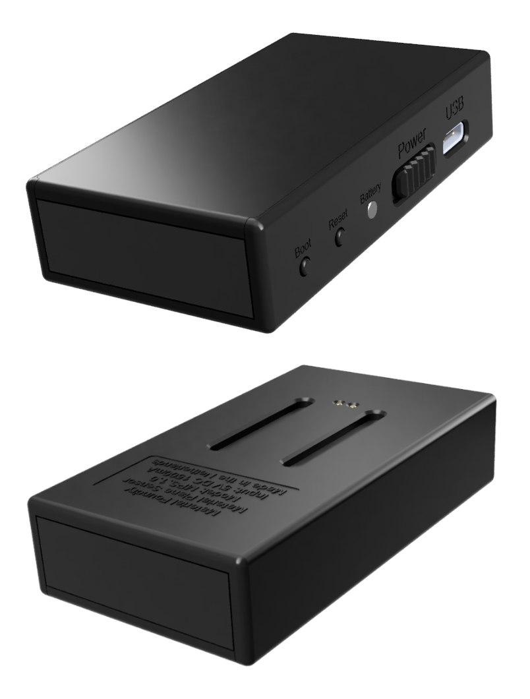

## Overview
{align=right width=33%}

The sensor is responsible for detecting the location of bases, onto which minis are placed. The sensor has a special infrared camera that can track sources of infrared light. After calibrating the sensor, the sensor can transmit the exact location of bases to the VTT over (2.4GHz) WiFi or USB, which can then move tokens.

The sensor has some important features on one side, see the image:

* <b>USB-C Connector:</b>  For charging, updating the firmware and alternative connection method.
* <b>Power Switch:</b> Sliding the switch towards the USB connector turns the sensor on.
* <b>Battery LED:</b> Battery and status indicator, see below.
* <b>Reset Switch:</b> Can be pressed to reset the sensor.
* <b>Boot Switch:</b> Can be used, in combination with the reset switch, to select the boot mode of the sensor. Only used for firmware updates, see [here](../Updating/sensorUpdating.md).

The front of the sensor can be identified by the shiny black window. This window only transmits infrared light, allowing the sensor to detect bases. For the best performance, this window should be kept clean.

The bottom of the sensor contains some basic information, such as the product name and model, and the input voltage and (maximum) current draw. There are 2 pins that allow the sensor to be charged on the Sensor Charging Dock Expansion. Embedded into the bottom of the sensor are 4 magnets which allow the sensor to be easily mounted onto the sensor mount or the above mentioned dock expansion. The 2 slots help with aligning the sensor properly on these 2 mounts.

<b>Specs</b>

* USB 2.0 Full Speed over a USB-C connection
* 2.4GHz 802.11b/g/n WiFi
* 1200mAh battery
* 5VDC at max 1500mA over USB-C or sensor charging dock expansion
* Programming through USB or web interface
* Power, reset and boot mode (for programming) switches
* Power and battery indicator LED
* Up to 16 simultaneous trackable bases (you can track as many bases as you want, but only up to 16 can be moved at the same time)
* Mounting on 3/8" microphone stand or 4x35mm countersunk screw into ceiling
* 44x77x18mm (WxLxH)
* 61 gram without mounting hardware, 83 gram with mounting hardware

## Power States
The sensor has 3 power states:

* <b>Off:</b> Power slider is switched to off, and the sensor is not charging. The sensor is completely powered down.
* <b>Active:</b> Power slider is switched to on. The sensor is now functioning normally and can detect bases and pens.
* <b>Charging:</b> Power is applied to the sensor to charge it.

<b>Charging</b> 
The sensor is charged either using a USB-C cable, or using a sensor charging dock expansion (see below). The sensor can draw up to 1000mA to charge the battery. 
The battery LED on the side of the base can indicate 5 different states:

* <b>Off:</b> Sensor is switched off and not charging.
* <b>Red (fading):</b> Sensor is charging.
* <b>Green (static):</b> Sensor charging completed.
* <b>Combination of red and green (static):</b> Indicates a rough battery level, where green means 100% and red means 0%.
* <b>Red (fast blinking):</b> An error has occured.

Charging from empty to full takes approximately 90 minutes. Charging can take longer if the power supply cannot provide enough current.

## Battery Life
Is the sensor is off, its power consumption is negligable. If it is on, the power consumption will depend on the activity. When no base or pen is detected for a while, it will go into low power mode to conserve power. You can expect around 20 hours of battery life for average gaming situations.

## Mounting
A mounting bracket is provided with the sensor, which can be used to mount the sensor to a microphone stand or, for example, the ceiling. More information on how to mount the sensor can be found [here](../SensorPositioning/sensorMounting.md).