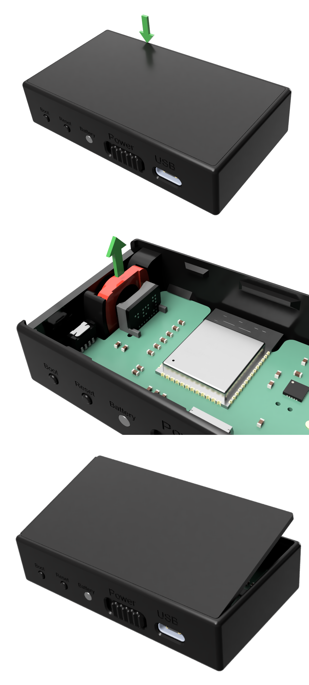

{align=right width=33%}

As discussed on the page about the [minimal sensor-to-display distance](../SensorPositioning/sensorDistance.md), it is possible to add a wide-angle lens to the sensor.

When ordering the hardware, this lens can be added as a pre-installed option, or it can be bought [separately](https://www.materialfoundry.nl/products/wide-angle-lens). 
To add or remove the lens, please follow the instructions below. If you're careful this should not damage the sensor, and any damage should be limited to cosmetic damage, however, proceed at your own risk.

1. To insert or remove the lens, you need to open the sensor. Do this by inserting a thin blade (such as a hobby knife) between the 2 parts of the enclosure at the location indicated by the green arrow in the top image and gently applying some sidewards and upwards pressure to pry the lid apart of the main body.
2. Move the lid away, being careful not to break the battery wires.
3. Remove the lens (shown in red in the middle picture) by gently pulling it in the direction of the green arrow. To insert the lens do the opposite.
4. Close the sensor by taking the lid and locating it to its position on the side with the USB port, see the bottom image. The holes in the lid should index with some extrusions in the main body.
5. Gently press the other side of the lid down. It can be helpful to apply some pressure on the side of the main body opposite of the USB port, away from the lid.