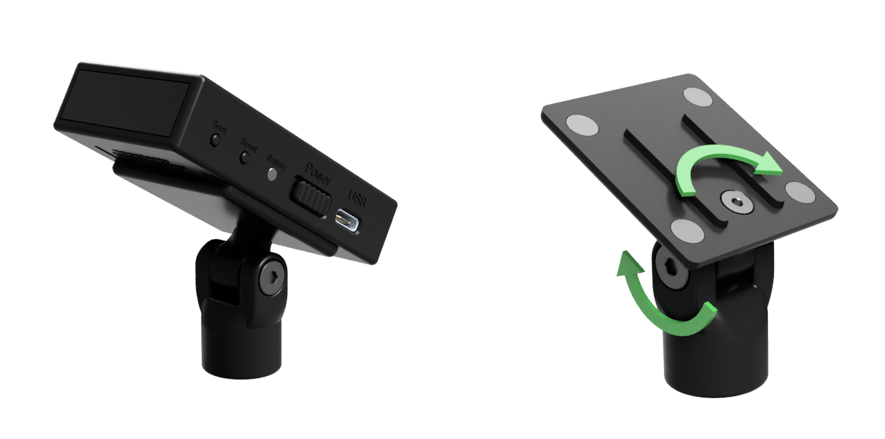
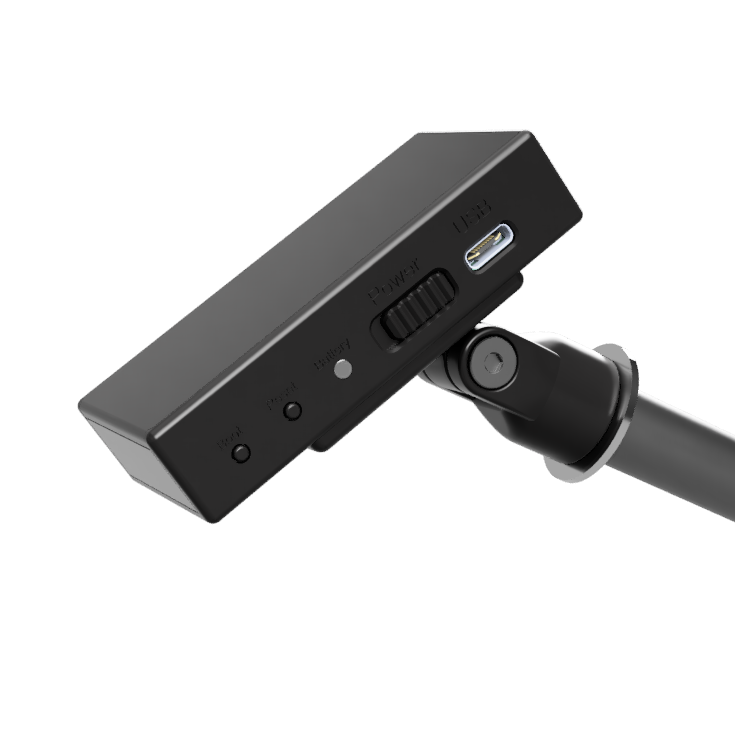
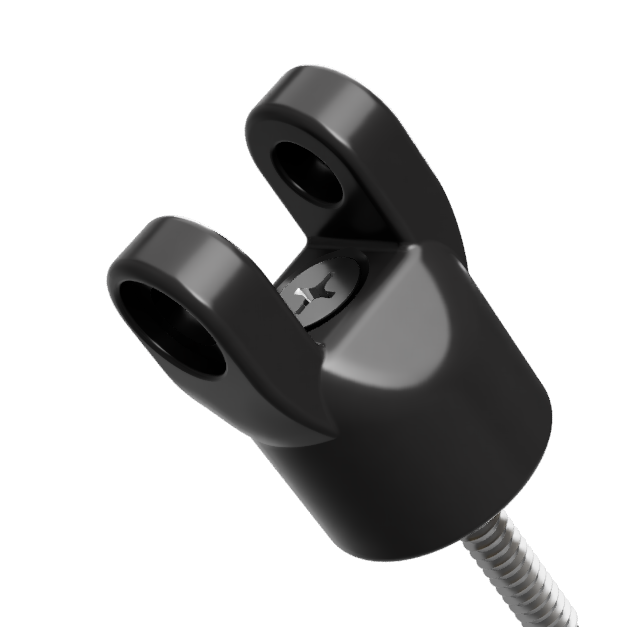

{align=right width=50%}

The sensor is provided with a mount to which the sensor magnetically attaches. 
This mount allows the sensor to be rotated in 2 directions, as indicated by the arrows in the top-right image. You can tighten or loosen the 2 screws to make this rotation easier or more difficult.

The mount was designed to be mounted in the following ways:
 

## Microphone Stand
{align=right width=25%}
The mount has 3/8"-16 thread at the bottom to allow the mount to be screwed onto a microphone stand, as shown in the bottom-left image. 3/8" is a standard thread for microphones outside of the US, in the US 5/8"-27 is more common. Adapters to convert 3/8" to 5/8" are easy to find and not very expensive.

When selecting a microphone stand, make sure it can reach high enough, or get a microphone stand extender. You want to take the minimum [sensor-to-display distance](sensorDistance.md) into account. 
You could also use wall or ceiling mounted microphone stands.

## Ceiling Mount
{align=right width=25%}
A second option is to attach the mount to the ceiling (or other surface). By removing the big bolt, you can take the mount apart, allowing you to fit a screw through the bottom part of the mount, as shown in the bottom-right image. 
You can use a countersunk screw with a maximum diameter of 4.5mm/0.177" (US screw size #9 or lower), and a minimum length of 40mm/1.5"

## Magnetic Mount
It is possible to attach a magnet to the bottom of the mount. This allows the sensor to be attached to ferromagnetic objects, such as light fixtures.

The easiest way is to source a suitable magnet is to search for 'rubber coated magnet'. Look for a 20x6mm one (22x6mm can also work, but this is lightly wider than the mount) with M4 internal thread. One with a post (extended thread) will fit, but this is not necessary. 
Attach it by removing the big bolt on the mount to take the mount apart. It is then possible to attach the magnet using a M4x22mm countersunk bolt (if the magnet has a post, you can reduce this to M4x16mm).