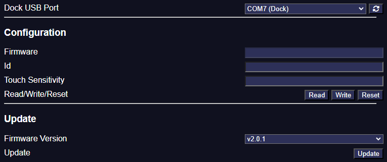
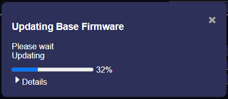

### Finding the Current Version
You can find the versions of the firmware in the following way:

* <b>Using Material Companion:</b> The versions can be reported in the [Base](https://materialfoundry.github.io/MaterialCompanion/materialPlane/#base) or [Pen](https://materialfoundry.github.io/MaterialCompanion/materialPlane/#pen) tab.

### Finding the Latest Version
You can find the latest versions of the firmware and webserver in one of the following ways:

* <b>Using Material Companion:</b> The latest versions are displayed in the 'Update' section in the [Base](https://materialfoundry.github.io/MaterialCompanion/materialPlane/#base) or [Pen](https://materialfoundry.github.io/MaterialCompanion/materialPlane/#pen) tab.
* <b>Using the Module's Downloads Tab:</b> The latest versions will be displayed in 'Latest' column on the [Downloads](../Foundry/foundryConfig.md#downloads) tab of the Material Plane configuration screen.
* <b>Using GitHub's Releases Page:</b> The releases pages on GitHub will list all the latest releases for the [base](https://github.com/MaterialFoundry/MaterialPlane_Base/releases) and [pen](https://github.com/MaterialFoundry/MaterialPlane_Pen/releases).

## Updating
Updating the base and pen is very similar, and is done using Material Companion. 
You will need to connect the dock to your computer using the USB port, and connect either a base to the charge slot with the 3 spring terminals, or the pen to its charging slot. 
<b>You cannot update the base if the pen is connected to the dock, or vise versa!</b>

{width=50%}

1. Open Material Companion and navigate to the 'Base' or 'Pen' sub-tab within the 'Material Plane' tab.
2. At the top, select the correct 'Dock USB Port'. The dock should show up as 'COM## (Dock)'. If it doesn't show up, try refreshing the USB ports. See [here](#finding-the-correct-usb-port) for more info.
3. At the bottom 'Update' section, select the 'Firmware Version' you want to update
6. Optionally, you could tick 'Show Pre-Releases' which will allow you to update a pre-release version (not recommended for normal use)
7. Press the 'Update' button
8. A popup will appear that gives the update progress, you can press 'Details' to get more details about the progress

    {align=center}

