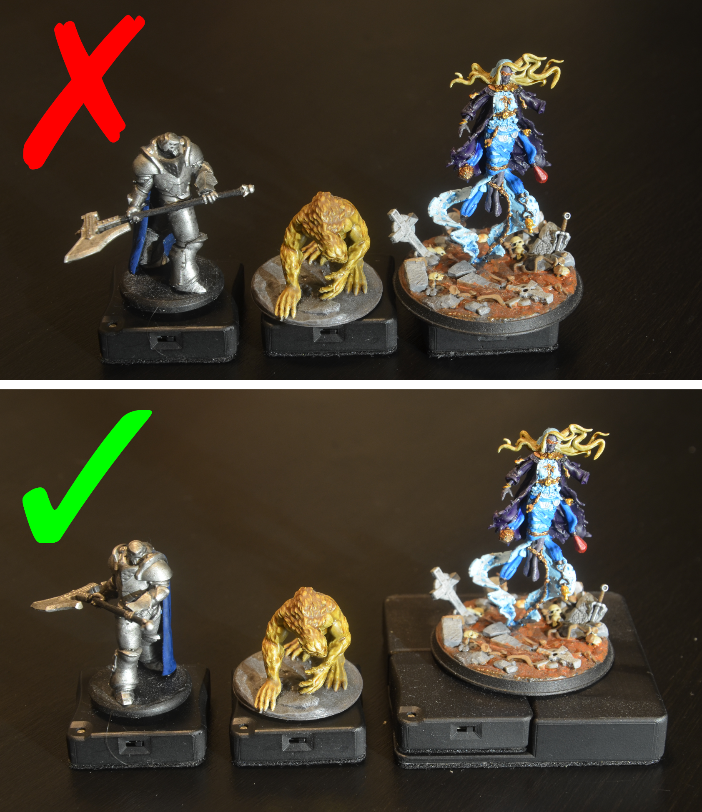
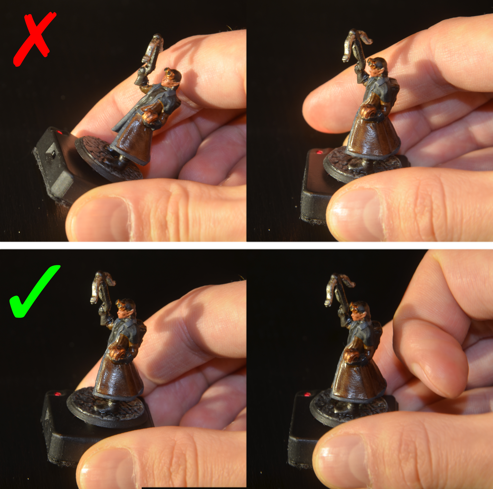

## Switching a Base On or Off
You can switch bases on using the slide switch at the top. Sliding it to the right (towards the LED) switches it on, indicated by 4 flashes of the red LED. Sliding it to the left (away from the LED) switches it off, indicated by 2 flashes of the red LED.

## Base Activation
A base is activated by touching the right of left side of the base, which will switch on the red LED and it will start emitting data to the sensor. You can adjust the sensitivity using Material Companion, as is explained [here](../basePenConfig.md). 
If you notice that the base stays activated, try lowering the sensitivity.

## Base Modes
The base has 2 different modes:

* <b>Normal Mode:</b> The base will act as 'normal', where it is in standby until the base is activated by touching it
* <b>Always On Mode:</b> In this mode the base will always emit infrared light. This can be useful for aligning the sensor and performing the sensor calibration procedure

With the sensor on, you can switch between these 2 modes by touching the right side of the base very shortly, waiting for the red LED to switch off, and touching the side of the base again. Repeat this 5 times and the red LED will start blinking rapidly to indicate that it has switched modes.

## Mounting Minis
A mini is placed on top of the bases in order to track the movement of said mini. While it is possible to just place them on there, and let gravity to its work, there are several options for a more secure mounting. Additionally, some guidelines should be followed regarding positioning of the mini on top the base.

### Mini Placement

{align=right width=33%}

When mounting a mini on a base, there is one important thing to remember: there needs to be line-of-sight between the infrared LED and the sensor. There are multiple ways in which the placement of the mini can affect this.

The image on the right shows 3 minis, with incorrect placement at the top and correct placement at the bottom. 
From left to right:

* The weapon of the mini is directly above the infrared LED. This means that in most situations the sensor will have a hard time detecting the base. This can be solved by rotating the mini.
* The base of the mini blocks the infrared LED, so the sensor cannot detect it. This can be solved by moving the mini a bit.
* The mini is too big for the base. There is no good way to mount it while keeping the infrared LED visible to the sensor. A [base adapter](https://www.materialfoundry.nl/products/base-adapter) can be used for bigger minis.

### Mounting Methods

<b>Magnet on Mini</b> 
Since the base has an embedded 10x10x1mm magnet, you could use a magnet on the bottom of the mini to keep it mounted securely, while making it easy to remove the mini. You can use either a square ([10x10x1mm](https://www.materialfoundry.nl/products/square-magnet) or similar) or a circular magnet ([10mmx1](https://www.materialfoundry.nl/products/round-magnet) or similar). The advantage of a square magnet is that you can be sure that the mini is correctly aligned, since rotation of the mini on the base is hindered (it can still rotate, but only onto 4 directions). Circular magnets allow more rotational freedom, but this can cause the mini or base to unintentionally rotate.

You will need to take the polarity of the magnet into account. For best results:

1. Place the magnet on top of the base
2. Apply a droplet of superglue to the top of the magnet
3. Place the mini on top of the magnet, holding it in place until dry

To ensure you won't glue the magnet to the base, you could add, for example, plastic film between the base and the magnet.

The attaction between the two magnets might be quite strong. If you are not careful you could break the mini when you try to mount it. For example, if the mini has thin legs, and you hold the mini by its torso while moving it towards the base, the base might fly up to the mini once it's near enough with enough force to break the legs. 
It is advisable to take both the base and the mini in hand, and then moving them towards each other, or holding the mini by its base while moving it towards the Material Plane base.

<b>Ferromagnetic Piece of Metal on Mini</b> 
Instead of magnets (see above), you could use a ferromagnetic piece of metal, since that would also be attracted to the magnet in the base. 
The mounting would be less secure, and you won't be able to prevent rotation like a square magnet would, but it should work fine. 
Some coins could work for this, for example a 5 eurocent coin.

<b>Double Sided Tape</b> 
Double sided tape could be used to mount the mini. Depending on how strong the tape is, this is either permanent or semi-permanent. Using weaker tape will allow you to easily switch minis without having to glue anything to the mini, at a risk that the base detaches and falls. 
It is possible to make strong tape weaker by touching it repeatedly with your finger.

<b>Glueing the Mini to the Base</b> 
While not advisable, you could glue the mini directly to the base. Keep in mind that this will prevent you from using [dock expanions](../HardwareOverview/dock.md#base-charging-dock-expansion). You also won't be able to rotate the mini on top of the base, but it will prove the most secure bond.

## Orientation and Holding of Bases

During the [calibration procedure](../calibration.md) you had to keep the orientation of the base constant relative to the display, for example by keeping the LED in the top-right. When using the base during gaming you have to stick to this orientation, so rotating the base is not possible. You can, of course, rotate the mini on top of the base.

{align=right width=33%}

When moving bases, you should try to keep them as horizontal as possible. If the base is held at an angle, the relative light emission of the base (so from the perspective of the sensor) is reduced, and if the angle is too big, the sensor will not be able to detect the base. 
An exception to this is if the base is located near the edge of the display. In this case, it can be helpful to angle the base towards the sensor.

Make sure your finger or any other object does not obscure the LED to prevent line of sight between the LED and sensor. Because the base is activated by touching one of its sides, this will usually not be an issue.

Take a look at the image on the right, which demonstrates these 2 problems, with the upper images showing the incorect way and the lower images the correct way of holding bases. 
From left to right:

* Base held at too much of an angle. Reduce the angle to make it easier for the sensor to detect the base.
* Index finger too close to the infrared LED, which might block the line-of-sight between the LED and sensor. Hold the base with the thumb and index finger, or move the index finger away.

## Token Detection
There are 2 ways Material Plane can detect which token has to be moved when a base is moved:

The main method is to use the id of the base, which can be linked to a specific token or actor. This means that whenever a specific base is moved, it will only move the linked token or actor (see [Base Setup](../foundryConfig.md#base-setup) for more info on how to configure that).

A secondary, fallback method is to use the location of the base. Whenever a base is moved, Material Plane checks if there are any tokens close enough. If there are, it will pick the nearest (that is allowed to be moved) and move that token. The disadvantage of this method is that if any interruption occurs, the token might be dropped. It can also result in the wrong token being moved if multiple tokens are close to each other.

Whenever more than one base is moved at a time, or the pen is used at the same time, the fallback method is always used.

