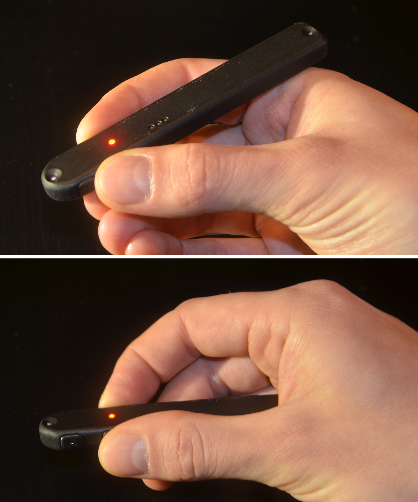

## Pen Activation
The pen is activated whenever one of its buttons are pressed, and it will stay activated for a set amount of time after all buttons have been released. By default this timeout is 10 seconds, but this can be configured using Material Companion as explained [here](../basePenConfig.md).

## Holding the Pen
{align=right width=33%}

To use the pen, the side with the LEDs must be facing up, towards the sensor. The side of the pen with the buttons is the front. For the A, C and D buttons, only the front LED needs to be exposed. When pressing the B button both the front and rear LED need to be exposed.

In general, it's best to hold the pen like a normal writing pen: the thumb and index finger hold the pen close to the buttons, with the rear of the pen resing on the part of the hand connecting the thumb and index finger, see the top image on the right.

Alternatively, the pen would be held as shown in the lower image on the right. While this can be more comfortable in some situations, you will not be able to use the function assigned to the B button, since the rear LED is blocked by the hand.

## B Button
The B button is special, because it enables both the front and rear LEDs. This means that the orientation of the pen can be determined. 
This is used for rotating things. For example, when using the 'Token' function, you can press B and rotate the pen to rotate a token.

## C Button
The C button is reserved for interacting with the pen menu. Pressing that button will always open the menu, regardless of the mode.

## Pen Menu
By pressing the C button the pen menu will open, it will automatically close when the pen is no longer used. Here, you can select the function of the pen. You select the function using either the C or D button. You can move the menu around by pressing and holding the center (Material Foundry logo) using the C or D button.

You can enable an info display by pressing the info button in the pen menu. This info display displays the current mode and the function of each button.

### Inner circle
The inner circle of the pen menu sets the mode of the pen. The 'Drawings', 'Templates' and 'Macros' modes will open a secondary ring of options. 
The following table gives a summary of all options of the pen menu. 

| Mode          | Icon                                                                                  | A Button          | B Button          | D Button          |
|------         |----------                                                                             |----------         |----------         |----------         |
| Canvas        |     | Pan canvas        | Zoom canvas       | Click canvas      |   
| Token         |                       | Deselect token    | Rotate token      | Move token        |
| Ruler         |                     | Undo last point   | Clear all points  | New point         |
| Target        |               | -                 | -                 | Target token      |
| Drawings      |               | Move drawing      | Rotate drawing    | Draw shape        |
| Templates     |   | Move tempalate    | Rotate template   | Draw template     |
| Macros        |    | User configurable | User configurable | User configurable |
| Info          |         | -                 | -                 | -                 |

### Canvas
The canvas mode allows some basic interaction with the canvas, such as panning or zooming the canvas with the A and B buttons, respecivetly. 
The D button will click on the canvas and can be used for things like opening doors.

### Token
The token mode will manipulate tokens. 
Tokens can be moved by pressing and holding the D button. They can be rotated by pressing the B button and rotating the pen, and tokens can be deselected with the A button.

### Ruler
Distances can be measured using the ruler mode. 
Start a measurement by pressing the D button. Using the A button a new ruler segment is created. Using the B button you can undo the last segment.

### Target
Press the D button to target a token.

### Drawings
With the drawings mode you can place or move drawings on the canvas. 
After placing a drawing using the 'Rectange', 'Ellipse', 'Polygon' or 'Freehand' mode, the pen will automatically default to the 'Select' mode. 
On the left of the pen menu there are 2 sets of colors. The top-left quadrant sets the fill color of the drawing, while the bottom-left quadrant sets the line color of the drawing.

| Mode      | Icon                                                                              | A Button          | B Button          | D Button          |
|------     |----------                                                                         |----------         |----------         |----------         |
| Select    |               | Move drawing      | Rotate drawing    | Move drawing      |   
| Rectangle/Ellipse/Freehand | //                                            | -                 | -                 | Draw shape        |
| Polygon   |   | -                 | Undo last segment | Place new segment |
| Clear     |                 | -                 | -                 | Remove drawing    |

### Templates

### Macros