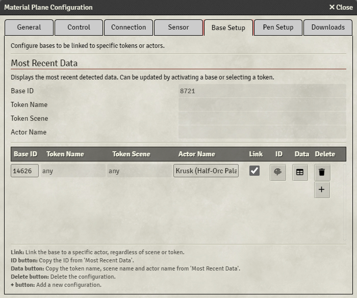
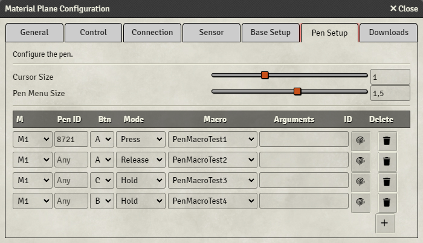





## Base Setup
{align=right width=50%}
Each production base sends out a unique ID when it is active. This ID allows Foundry to know exactly which base was moved, and can therefore be used to link a base to a specific token or actor. 

At the top, you'll find the data of the most recently moved base and selected token. Activating a different base, or selecting a different token will update this data. 
At the bottom, you can configure the linking of tokens or actors to a base.

You can link a base to a specific token on a specific scene, or to a specific actor (which will be active for all scenes). 
If a base is linked to a token or actor, but that token or actor is not on the current scene, the base will act like a normal unlinked base.

By pressing the '+' button, you can add a new rule. Each rule has the following settings:

* <b>Base Id</b>: The Id of the base that you want to link 
* <b>Token Name</b>: The name of the token that you want to link (only required if 'Link Actor' is not enabled) 
* <b>Token Scene</b>: The scene that you want this link to be active in (only required if 'Link Actor' is not enabled) 
* <b>Actor Name</b>: The name of the actor that you want to link (only required if 'Link Actor' is enabled) 
* <b>Link (Actor)</b>: Enabling this will link the actor, instead of the token. This makes the rule active for all scenes 
* <b>ID</b>: Pressing this button will take the most recently detected base Id, and fill this in 
* <b>Data</b>: Pressing this button will take the token data of the most recent selected token, and fill this in 
* <b>Delete</b>: Delete the rule 

Basic linking will follow these steps:

1. Activate the desired base
2. Select the desired token
3. Press the '+' button to add a new rule
4. Press the 'ID' and 'Data' buttons to fill in the base id and token data
5. (Optional) enable 'Link Actor'

You can also manually enter all the data.

## Pen Setup
{align=right width=50%}
The 'Pen Setup' tab allows you to configure some settings related to the pen.

The top part of this tab has 2 settings:

* <b>Cursor Size:</b> Sets the cursor size of the pen
* <b>Pen Menu Size:</b> Sets the size of the pen menu

The bottom part of this tab can be used to assing macros to pen buttons by configuring rules. For info on how to execute these macros, please refer to [this](Usage/pen.md#macros) page.

By pressing the '+' button, you can add a new rule. Each rule has the following settings:

* <b>M:</b> The macro group to apply this rule to
* <b>Pen Id:</b> The pen id to apply this rule to, or 'any' if no id has been entered
* <b>Btn:</b> The button to press to call the macro
* <b>Mode:</b> The press mode to call the macro
    * <i>Press:</i> Will call the macro if the button is pressed
    * <i>Hold:</i> Will call the macro continuously while the button is held
    * <i>Release:</i> Will call the macro if the button is released
* <b>Macro:</b> The macro to call
* <b>Arguments:</b> (Optional) macro arguments to use
* <b>ID:</b> Copy the id of the last pen that has been detected
* <b>Delete:</b> Delete the rule

<b>Be careful with assigning macros to the C button, since this button will open the pen menu.</b>

