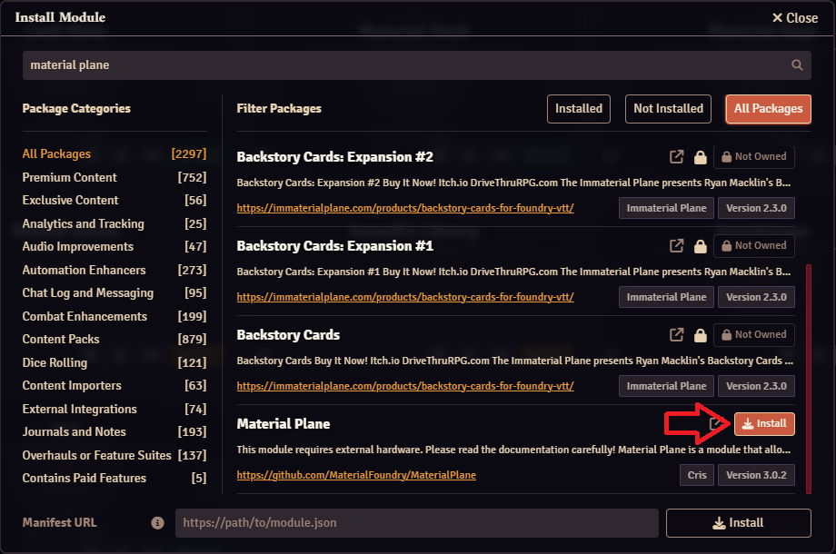
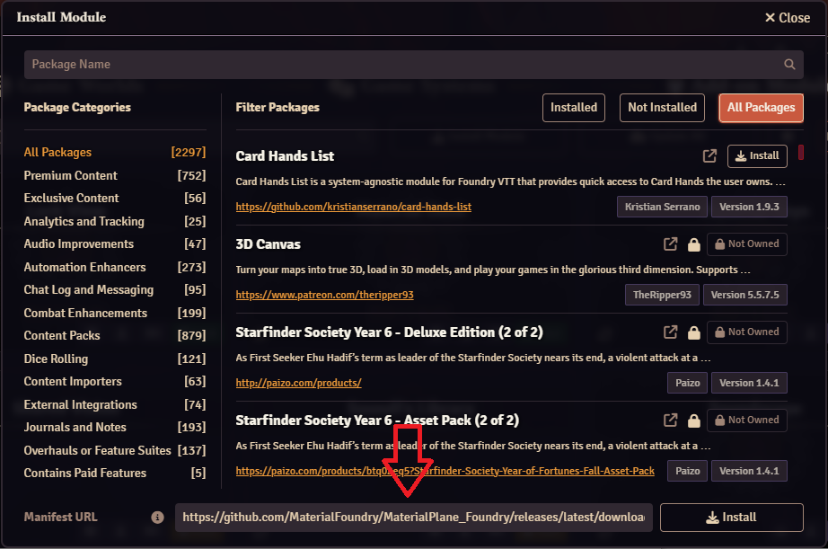
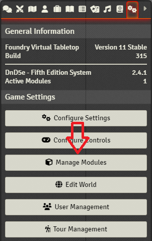
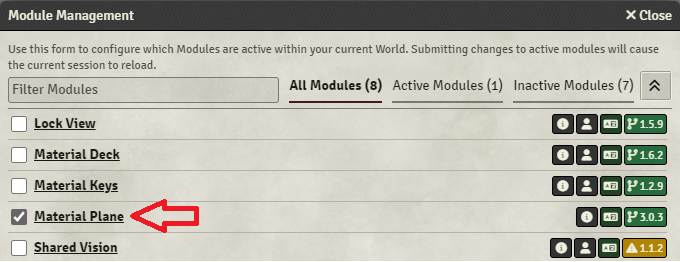
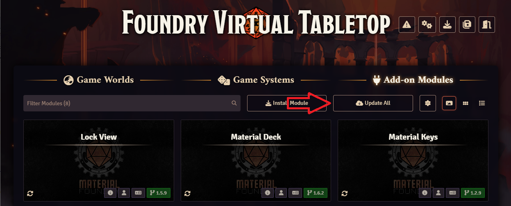
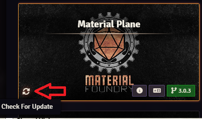
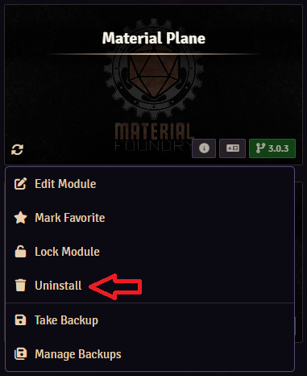

## Installing the Module
To use Material Plane, you must install the module. There are several ways to do this:

<b>Built-In Module Browser</b> 
The easiest way to install modules is using the built-in module browser.

1. Start Foundry VTT and make sure you're in the 'Setup' screen
2. Navigate to the 'Add-on Modules' tab
3. Press the 'Install Module' button

    {width=50%}

4. Search for 'Material Plane' in the search bar at the top
5. Press the 'Install' button

    {width=50%}

<b>Manifest URL</b> 
You can use the module's manifest URL to install the module. The main reason for this is to install a specific version of the module.

You can find the manifest URL for all available versions [here](https://foundryvtt.com/packages/MaterialPlane). 
Choose the version you want, and right-click 'Manifest URL' to copy the URL.

Alternatively, you could use this manifest URL which always points to the latest release: 
`https://github.com/MaterialFoundry/MaterialPlane_Foundry/releases/latest/download/module.json`

1. Start Foundry VTT and make sure you're in the 'Setup' screen
2. Navigate to the 'Add-on Modules' tab
3. Press the 'Install Module' button

    {width=50%}

4. At the bottom you can find the 'Manifest URL' field, copy the manifest URL into this field and press 'Install'

    {width=50%}

<b>Manual</b> 
The last option is a manual installation

1. Download the 'module.zip' file from [GitHub](https://github.com/MaterialFoundry/MaterialPlane_Foundry/releases)
2. Extract this file into the 'User Data Path' of your Foundry installation
3. (Re)start Foundry VTT

## Enabling the Module
After installing the module, it must be enabled for each world in which you want to use the module:

1. Start Foundry VTT and the world you want to use it in
2. Open the 'Game Settings' sidebar tab (on the right of the screen, cogs icon)
3. Select 'Manage Modules'

    

4. Search for 'Material Plane' and tick the box to the left of it

    {width=50%}

5. Press 'Save Module Settings'

## Updating the Module
Modules in Foundry do not automatically update. You will have to check regularly if an update is available. 
Within Foundry you can either update all modules, or a single module:

1. Start Foundry VTT and make sure you're in the 'Setup' screen
2. Navigate to the 'Add-on Modules' tab
3. Either:
    * Click 'Update All' to update all modules

    {width=50%}

    * Click the update button for the module you want to update

    

## Uninstalling the Module
To uninstall the module:

1. Start Foundry VTT and make sure you're in the 'Setup' screen
2. Navigate to the 'Add-on Modules' tab
3. Right-click the 'Material Plane' icon and click 'Uninstall'

    
