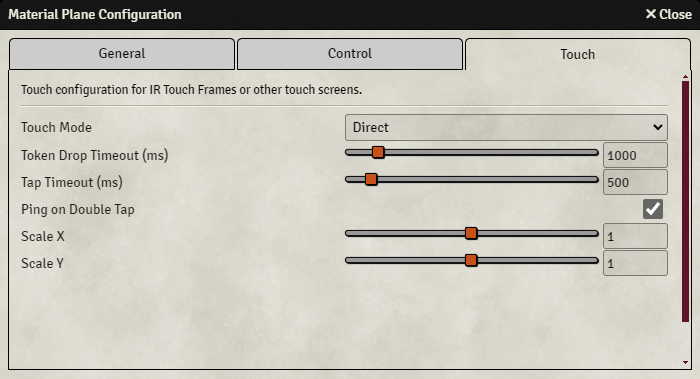







## Touch
{align=right width=50%}

The touch tab is used to configure settings related to the touch functionality.

* <b>Touch Mode:</b> Configures how taps and mini movement are detected, see [below](#touch-modes).
* <b>Token Drop Timeout:</b> Every time that a token is moved, a timer starts (or is reset). Once that timer has reached this value in milliseconds, it will drop the token. So if configured to 500ms and a mini hasn't been moved for 500ms, that mini will be dropped.
* <b>Tap Timeout:</b> Sets the timeout to detect a tap, see [below](#touch-modes).
* <b>Ping on Double Tap:</b> If a double tap is performed (within 500ms), a ping will be generated at the location of the double tap.
* <b>Scale X:</b> Scales the touch on the x-axis.
* <b>Scale Y:</b> Scales the touch on the y-axis.

#### Touch Modes
Material Plane offers 3 different touch modes, 2 of which allow for tapping on the canvas for additional functionality. Some modes will work better for different touch technologies. For touch frames, 'Raise Mini' is recommended, while for capacitive touch screens either 'Direct' or 'Tap Timeout' can work.

The touch frame or touch screen can be used to interact with other objects on the canvas. Some display elements (such as the control buttons) can be accessed, and you can open or close a door by tapping the door icon.
In order for this to work, 'Touch Mode' and 'Tap Timeout' must be configured in the Touch Settings tab of the configuration menu.

Tap modes:

* <b>Direct:</b> Tokens will move when touched. Disables tapping functionality.
* <b>Tap Timeout:</b> When a new touch is detected, a timer will start. If the touch is removed before the timer counts up to 'Tap Timeout', it will assume that the screen was tapped, otherwise it will assume that a mini was placed. So if 'Tap Timeout' is set to 500ms, and you want to tap, you must touch the screen and remove your finger in half a second. This also means that when you want to move a mini, there is a half a second delay before the token actually moves.
* <b>Raise Mini:</b> When a new touch is detected, Material Plane will check if a touch has recently (within the last 'Tap Timeout' ms) ended near the new touch. If that's the case, Material Plane will assume that a mini is being moved, otherwise it'll assume it's a tap. So if 'Tap Timeout' is set to 1000ms, and you want to move a mini, you must raise that mini, and place it back down before you can move (which you already have to do, anyway) within 1 second. Taps are detected immediately anywhere on the screen, except when you've recently (within 1 second, in this case) raised a mini close to the place you want to tap.

Note that tapping takes up 1 touch point. So for a standard touch screen with 10 touch points, you'll be limited to using 9 minis.