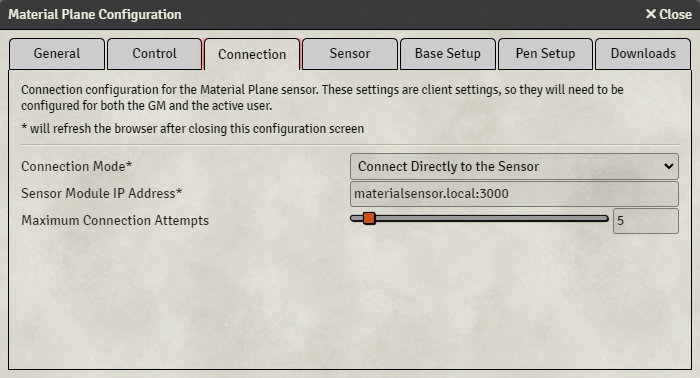

## Connection
{align=right width=50%}
This tab allows you to configure how the sensor will connect to Foundry.

Depending on your setup, you will either connect the sensor and Foundry directly, or through Material Companion. Please refer to the [Sensor Configuration](SensorConfiguration/sensorConnecting.md#connecting-to-the-sensor) page for more info on the connection methods and why you would choose one or the other.

* <b>Connection Mode:</b> Sets how Foundry will try to connect to the sensor:
    * <i>Connect Directly to the Sensor:</i> Foundry will attempt to connect directly to the sensor
    * <i>Connect Through Material Companion:</i> Foundry will attempt to connect to Material Companion, which will then attempt to connect to the sensor
    * <i>Don't Connect:</i> Foundry will not attempt to connect to the sensor
* <b>Sensor Module IP Address:</b> The address of the sensor. Find out the address [here](SensorConfiguration/sensorConnecting.md#sensor-address)
* <b>Material Companion IP Address:</b> The IP address of Material Companion. Find out the IP address [here](https://github.com/MaterialFoundry/MaterialCompanion/wiki/Overview)
* <b>Maximum Connection Attempt:</b> Foundry will attempt to connect to either the sensor or Material Companion for this many times. After that it will stop trying, until it is refreshed

## Sensor
This tab is used to configure the [sensor settings](SensorConfiguration/sensorSettings.md).