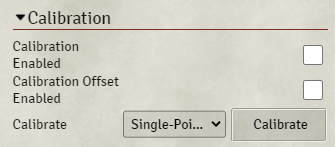
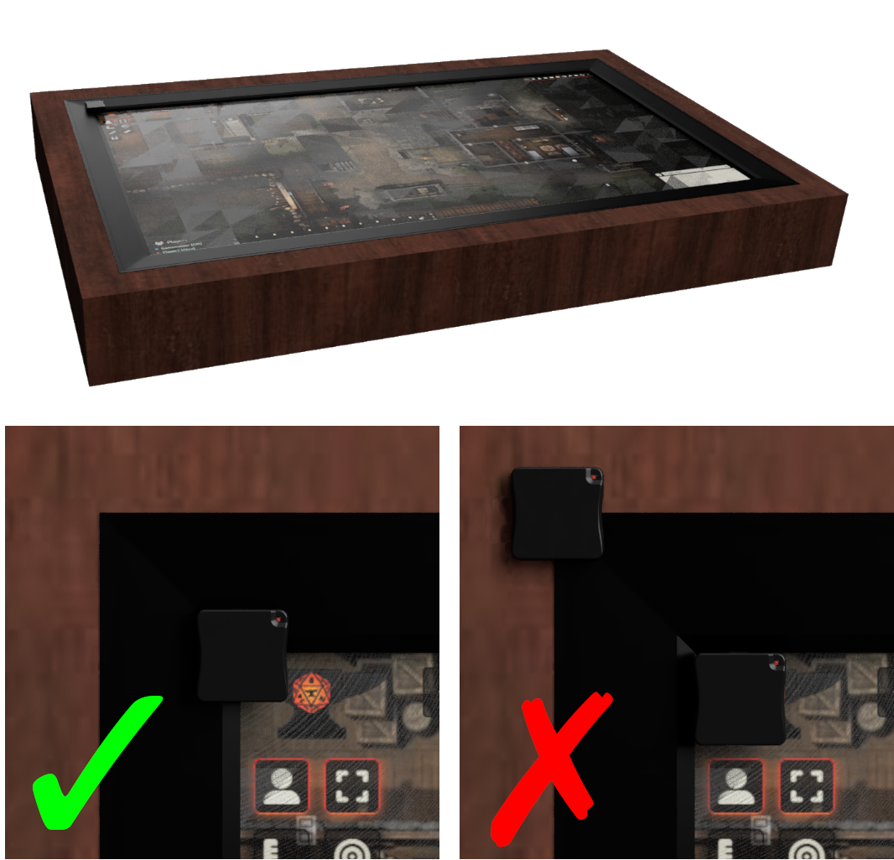
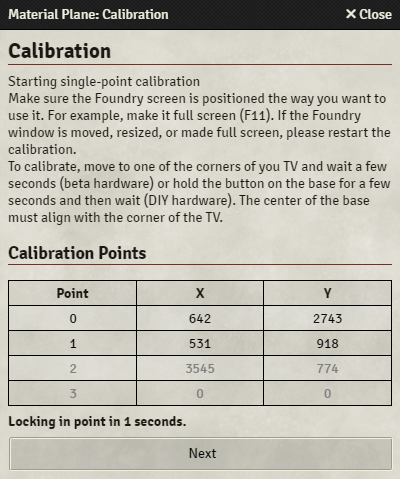
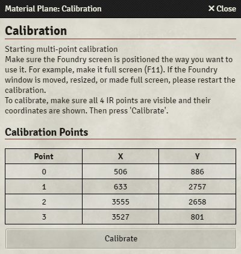
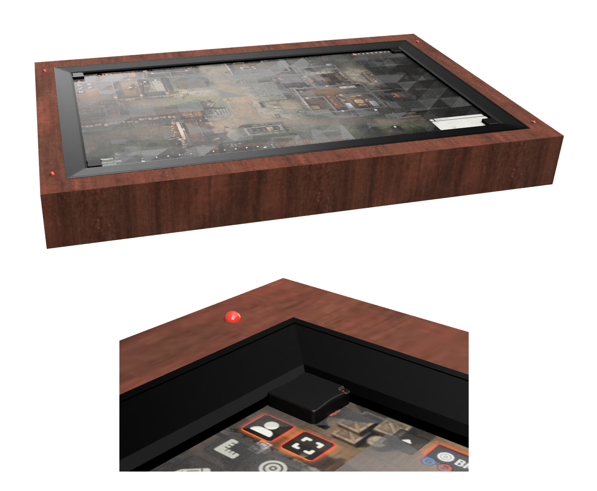

To function properly, the sensor needs to know the position of your display. To do this, a calibration procedure is required where you tell the sensor where the 4 corners of your display are. 
 
{align=right}
Calibration is performed in the [Sensor](Foundry/foundryConfig.md#sensor) tab of the 'Material Plane Configuration' screen. 
Under the 'Calibration' section you can find 2 checkboxes. These checkboxes allow you to enable or disable the calibration and calibration offset. Switching them off will result in the sensor outputting raw position data, switching them on will result in the sensor outputting calibrated data (assuming you've performed the calibration procedure). 
 
Below that there's a 'Calibrate' button that will start the calibration procedure.

You should make sure the sensor is correctly [configured](SensorConfiguration/sensorSettings.md) before calibrating.

There are 3 calibration options:

* <b>[Single-Point Calibration](#single-point-calibration):</b> Each calibration point is measured one at a time
* <b>[Multipoint Calibration](#multipoint-calibration):</b> All 4 calibration points are measured at the same time
* <b>[Offset Calibration](#offset-calibration):</b> This allows you to configure offsets from the normal calibration points, allowing you to define your own (more convenient) calibration points

<b>Note</b>: Calibration must be performed using bases, you cannot calibrate with a pen. 

## Base Positioning During Calibration
{align=right width=50%}

When calibrating the sensor, there are 2 important things to note regarding base positioning:

### Base Orientation
The orientation of the base, relative to the display, must stay constant during calibration (and normal use). For example, take the image on the right, which shows a TV inside a wooden enclosure. The base is rotated so the LED on the base is located on the top-right side. For each calibration point, the base rotation must stay the same, so for each calibration point the LED has to be located on the top-right side.

### Base Location
Unless you use offset calibration, you will need to align the center of the base with the corner of the (active part of the) display. Take a look at the 2 bottom images on the right. In the right (incorrect) image, a base is located inside the (raised) bezel of the display while another is located on the outside corner of the whole display (the corner of the bezel). In the left image the base is correctly located, with the center of the base aligned with the corner of the display.

## Single-Point Calibration
Using single-point calibration you calibrate each corner one at a time.

{align=right}

1. Make sure Foundry is running full-screen (F11).
2. Select 'Single-Point Calibration'.
3. After pressing the 'Calibrate' button, a popup window will appear with a table for the 4 corners of your display.
4. Activate a base by {{ baseActivation }} and move it to one of the corners of your display, the coordinates should show up in grey for point 0. <b>Make sure the center of the base aligns with the corner of your display, see [here](#base-positioning-during-calibration).</b>
5. Release the base and wait a few seconds or press the 'Next' button to move to the next point. The calibration point is now locked in and its coordinates should turn black.
6. Repeat this process for all 4 corners, you can do the corners in any order.
7. After the 4th corner the calibration procedure is completed. Either close the popup manually or wait 5 seconds for the popup to close automatically.
8. Exit the 'Material Plane Configuration' screen and try to move a token. If the procedure went correctly the token will stay directly underneath the base. Move it across the entire display to make sure the calibration is correct everywhere.
9. If the token does not stay directly underneath the base take note of [how accurate the calibration should be](#calibration-accuracy).

## Multipoint Calibration
Using multipoint calibration you calibrate all four corners of your display at the same time. To do this you must use 4 bases or other infrared sources and have them activated at the same time. This can be done  using the production bases, or by  mounting 4 infrared LEDs close to the display and using [offset calibration](#offset-calibration).


The easiest way to do this is to put the bases in 'always-on' mode: Touch the side of the base very short, wait for the red LED to switch off, touch the side of the base again. Repeat this 5 times and the red LED will start blinking.


{align=right}

1. Make sure Foundry is running full-screen (F11).
2. Select 'Multipoint Calibration'.
3. After pressing the 'Calibrate' button, a popup window will appear with a table for the 4 corners of your display.
4. Switch on the infrared LEDs or move 4 bases into each corner of your display, <b>making sure the center of the bases aligns with the corners of your display, see [here](#base-positioning-during-calibration)</b>. The coordinates of the should show up in the table.
5. When you're happy, press 'Calibrate', and the calibration procedure is done.
7. Exit the 'Material Plane Configuration' screen and try to move a token. If the procedure went correctly the token will stay directly underneath the base. Move it across the entire display to make sure the calibration is correct everywhere.
8. If the token does not stay directly underneath the base take note of [how accurate the calibration should be](#calibration-accuracy).

## Offset Calibration
{align=right width=50%}

With the previous calibration methods you had to align the center of the base exactly with the corners of your display. Using offset calibration you can choose different points to calibrate to. 
What offset calibration essentially does is defining the offset of the calibration points from the corner of the display. As long as the position of these offset calibration points don't move with respect to the display, they should always give the same calibration results.

For example, as shown in the image on the right, your display has a raised bezel. Using offset calibration you can move the base into the corner created by the bezel and use that as the calibration point. This allows for a fast and easy to locate calibration point.

Another option, also shown in the image, is to embed 4 infrared LEDs into the display enclosure or gaming table. In this case, all you would need to do to calibrate is starting the multipoint calibration and switching on the LEDs.

1. Calibrate using 'Single-Point' or 'Multipoint' calibration, but instead of placing bases in the corners of your display, you use your self-defined calibration points (for example the base inside the raised bezel or the embedded infrared LEDs).
2. Select 'Offset' calibration, and follow the exact procedure for 'Single-Point' calibration. This time you do need to place the bases on the corners of your display. <b>Make sure the center of the base aligns with the corner of your display, see [here](#base-positioning-during-calibration).</b>

Once you have performed these steps, whenever you need to recalibrate you only need to perform step 1 using your self-defined calibration points.

## Calibration Accuracy
Getting a perfect calibration can be difficult, because aliging the center of the base with the corner of the display can, depending on the geometry of your display, be difficult. There might also be other (scaling) issues. 
If the sensor has the lens installed a slight fisheye distortion is also to be expected.


During normal use some inaccuracy isn't a problem, because tokens will snap to the grid. This means that the inaccuracy should be small enough that if a base is located exactly on the grid, the token is at least 50% inside the intended grid space.

An inaccuracy smaller than 1/3 of a grid space in either x or y direction can probably be ignored. To make sure no problems arise, move a token across the entire display to check that the inaccuracy falls below that everywhere.

If you notice that the inaccuracy is constant across the entire display, you could introduce an x or y offset in the [transform](SensorConfiguration/sensorSettings.md#transform) section of the sensor settings. If the inaccuracy does not stay constant, you could try changing the x or y scale, also in the [transform](SensorConfiguration/sensorSettings.md#transform) section of the sensor settings.